# New in Simple DNS Plus (v. 5.1)

New features in v. 5.1:  
[Suspending Zones](#suspend)  
[Remote logging to syslog server](#syslog)  
[Response Filtering - Stops "DNS rebinding attacks"](#rfilter)  
[Stronger protection against DNS spoofing (cache poisoning) attacks](#spoofing)  
[Choose events for Windows Event Log](#events)  
[Import a list of domain names](#import)  
[Bulk update primary DNS server IP for secondary zones](#bulk)  
[New and updated HTTP API commands](#httpapi)  
[Information bar for expired secondary zones](#expired)  
[Export to standard boot file](#export)  
[Automatic test of firewall EDNS0 support](#edns0)  
[Miscellaneous](#misc)  
[New RFC and draft support](#rfc)

### Suspending Zones{#suspend}

Suspending a zone allows you to temporarily stop serving data for a zone without deleting the zone.  
This can be useful for example if you are hosting the domain name for someone else, and they forgot to pay their bill...  
In the DNS Records window suspended zones are marked with a "paused" icon and a red zone name:

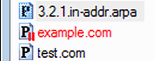

You can suspend / resume a zone from the right-click popup-menu:

 

When you suspend or resume a zone on a "super master" server, the zone's suspended status is automatically transferred to all Simple DNS Plus "super slave" servers.

In the main Options dialog, there is a new section to configure how Simple DNS Plus responds to DNS requests for names under suspended zones:

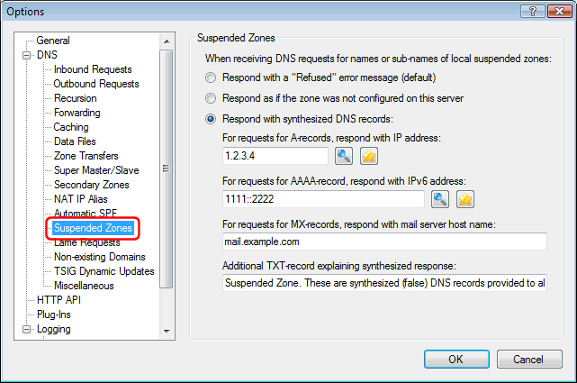

In the Export Wizard, you can select to included suspended zones or not:

We have added a new "Suspended" column in the Zone Database Viewer tool:

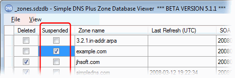

And finally, the HTTP API has been extended with two new commands; "suspendzone" and "resumezone", and the XML version of the "zonelist" command has been extended with a new "suspended" attribute:

### Remote logging to syslog server{#syslog}

Log data can be sent to a remote syslog server using the standard syslog protocol (RFC3164).  
This can be useful centralize logging and/or take advantage of various alerting features of syslog server software.  
There is a new "Syslog Server" section in the main Options dialog to configure this:

Many different syslog server software packages exist for various operating systems.  
A nice choice for Windows is the "Kiwi Syslog Deamon" from [Kiwi Enterprises](http://www.kiwisyslog.com){target=_blank} which is shown here receiving data from Simple DNS Plus:

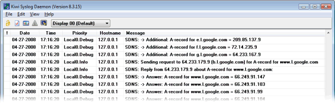

### Response Filtering - Stops "DNS rebinding attacks"{#rfilter}

Your web-browser will generally allow any script, Java object, Flash object, etc. to communicate via HTTP / TCP with the server that served a web-page for as long as that web-page is open in the browser.  
This is controlled by the host name specified in the web-page URL.  
A [DNS rebinding attack](http://crypto.stanford.edu/dns/){target=_blank} is done by having the DNS record for the host name time out very quickly (low TTL and other tricks) and then serve a new IP address for the host name in response to the next DNS request ("rebinding").  
The new IP address would be the private/local IP address of an intranet server or device at your location. Now with a bit of scripting, the attacker can in effect use your browser as a gateway to your entire intranet - completely bypassing your firewall.  
The same type attack may also be possible with other Internet applications that rely on host names for security.

Browser companies are taking steps to prevent this in new browser versions, but it is much more efficient and secure to stop this type of attack at the DNS level by filtering out any private/local IP addresses in DNS responses from outside DNS servers:

The log will show removed host records like this:

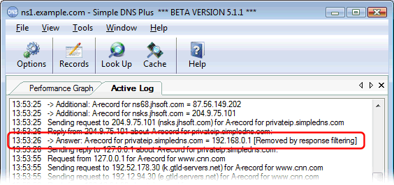

### Stronger protection against DNS spoofing (cache poisoning) attacks{#spoofing}

Two new features provide additional protection against DNS spoofing attacks:  
1) Option to allocate a new random port for each outbound DNS request - and only accept a response sent back to the same port. In recent news this is also called "port randomization".  
NOTE: This option was enhanced in build 103. Previous builds used random ports from a limited range whereas build 103 and later uses the full range of possible port numbers.  
2) New "Ignore responses which do not echo the request question section" option.  
Both of these features are based on the recommendations in a new Internet draft (soon to be RFC) [Measures for making DNS more resilient against forged answers](http://tools.ietf.org/html/draft-ietf-dnsext-forgery-resilience){target=_blank}.

### Choose events for Windows Event Log{#events}

Previous versions could also record events to the Windows Event Log, but this was all or nothing.  
In v. 5.1 you can choose which specific events to record (or not).  
This can be useful to exclude events that you do not care about if your event log is filling up to quickly.  
It can also make it easier to use eventtriggers / Task Scheduler to process events with scripts/programs, as you can choose to record only those events that you want to process.

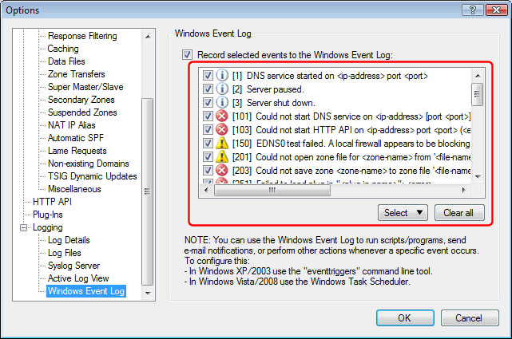

### Import a list of domain names{#import}

A new option in the Import Wizard lets you import a list of domain names from a simple text file:

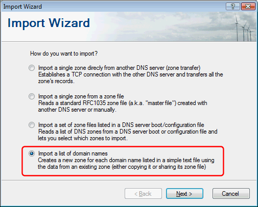

You need to specify the domain name list file and which existing zone to copy/shared zone data from:

And finally you can select which zones from the list you want to import:

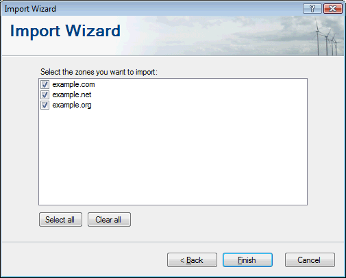

### Bulk update primary DNS server IP for secondary zones{#bulk}

Use this new option in the Bulk Update Wizard on your secondary servers when the IP address of your primary DNS server has changed to quickly update all your secondary zones:

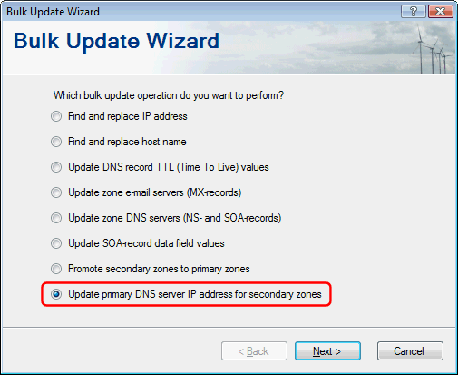

### New and updated HTTP API commands{#httpapi}

- New "pluginstate", "getpluginconfig" and "updatepluginconfig" commands to fetch/update plug-in instance state/configuration data (added in v. 5.1 build 122).
- New "zonestatus" command to get the current status of a zone (added in v. 5.1 build 121).
- New "getconfig" and "updateconfig" commands - retrieves/updates the Simple DNS Plus configuration (Options dialog settings).
- New "zonegrouplist", "addzonegroup", "renamezonegroup", and "removezonegroup" commands to manage zone groups.
- New "aliaszonelist" and "addaliaszone" commands to manage zones using same zone file.
- New "comment" parameter added to "updatehost", "addrecord", and "updaterecord" commands for specifying record comments (no longer adds automatic comment "Added via HTTP API at ...").
- New "format" parameter added to "zonelist" command. The value can be either "xml" or "text".  
This replaces the "listtype" parameter which still works but is now deprecated.
- New "suspendzone" and "resumezone" commands - see "Suspending Zones" above.
- XML version of the "zonelist" command has new "suspended" attribute - see "Suspending Zones" above.
- The "updatezone" command will no longer accept a "data" field without at least a valid SOA-record for primary zones (does not apply for secondary zones).

### Information bar for expired secondary zones{#expired}

When a secondary zone has expired (because of problems communicating with the primary DNS server) or has not yet been transferred from the primary DNS server, Simple DNS Plus plus will respond to queries for names under that zone with a "server failure" response.  
This new information bar makes it easier to recognize this situation:

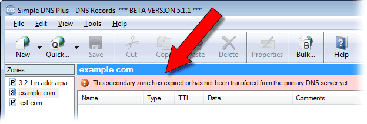

### Export to standard boot file{#export}

Simple DNS Plus v. 5.0 and later uses a proprietary database format for storing its list of DNS zones.  
While we hope you never need or want to use another DNS server, we don't want you to feel locked in either.  
This new Export Wizard function allows you to easily export the zone list to a standard boot file format which most DNS servers can either use directly or import from.  
Note: This function is also available in v. 5.0 as part of the external zone database viewer tool (ZoneDBViewer.exe).  
However moving it to the Export Wizard makes it easier to find and adds options to filter the exported file by zone groups and to exclude suspended zones.

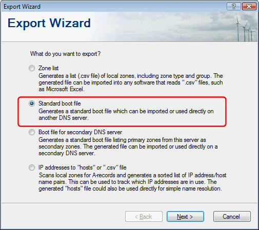

### Automatic test of firewall EDNS0 support{#edns0}

We introduced EDNS0 in Simple DNS Plus v. 5.0. EDNS0 is a relatively new addition to the DNS protocol and is a way to extend DNS UDP packet size and add other options to the DNS protocol.  
It turns out that many users have firewalls that block EDNS0 packets (typically Cisco PIX with older firmware).  
This can be very difficult to troubleshoot since you typically won't know that this is what you are looking for.  
So in v. 5.1 we have added an option to test for this problem at start up (enabled by default).  
If the test is negative, a warning will be logged (and written to the Windows Event Log if enabled), and Simple DNS Plus will then proceed without using EDNS0.

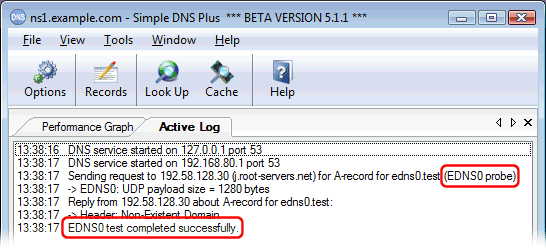

### Miscellaneous{#misc}

- The "New Zone Wizard" now supports /31 and /32 (single IP) reverse zones.
- Lists in IP Address Blocking dialog now permits selecting multiple items (shift/ctrl) for faster removal of many entries.
- Enhanced "Check for Updates" function (doesn't open browser).
- Extended data length for automatic SPF records (was limited 255 characters in previous versions, now 32767 characters.
- Removed v. 5.0 option "Refuse DNS requests for record type ANY".
- Moved options "Enable Round Robin (rotate DNS records in responses)" and "Always include NS referral in DNS responses from local zones" to "Inbound DNS Requests" section in Options dialog
- Renamed option "Only accept DNS responses from the IP address that request was sent to" to "Ignore responses not coming from the IP address that request was sent to" and moved it to "Outbound DNS Requests" section in Options dialog.
- Moved Active Log View settings to separate section in Options dialog.
- Now ignores duplicate DNS servers (different NS-names but same IP) when resolving.
- Options dialog opens with same section selected as the last time it was open during the same session (GUI/tray running).
- No longer sends 3rd request without EDNS0 - not needed with new EDNS0 test option.
- Now retries IXFR without EDNS0 when receiving FORMERR response (to counter bug in MS DNS Win2003).
- Zone group data moved to separate "_zonegroups.xml" file in data files directory (this data was part of "editrecs.config.xml" in v. 5.0)
- New option "Query plug-ins before local zones (plug-in data overrides local zones)" in Options dialog / Plug-Ins section (added in v. 5.1 build 115).

### New RFC and draft support{#rfc}

\- [RFC3164](http://www.rfc-editor.org/rfc/rfc3164.txt){target=_blank} - The BSD syslog Protocol.  
\- [draft-ietf-dnsext-forgery-resilience](http://tools.ietf.org/html/draft-ietf-dnsext-forgery-resilience){target=_blank} - Measures for making DNS more resilient against forged answers.

