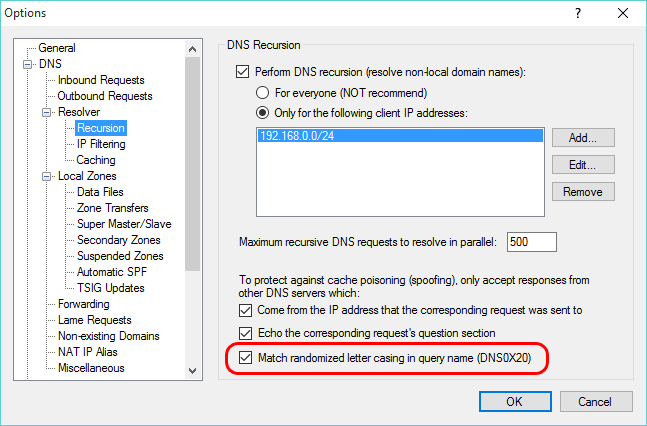
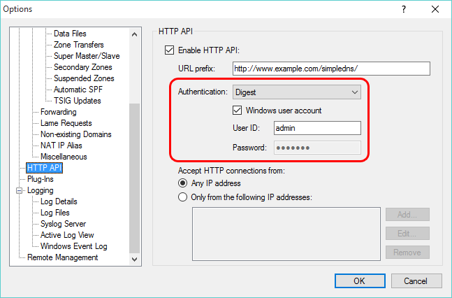
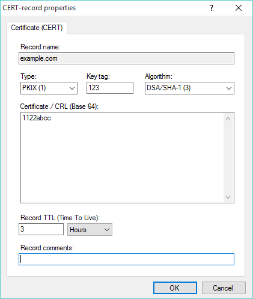
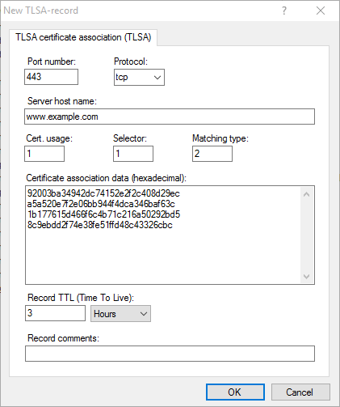

---
category: 17
frontpage: false
comments: true
vgroup: 7
vname: v. 5.3
vsort: 53
created-utc: 2019-01-01
modified-utc: 2019-01-01
---
# New in Simple DNS Plus (v. 5.3)

### ALIAS-records (Auto Resolved Alias)

ALIAS-records are virtual alias records resolved by Simple DNS Plus at at the time of each request - providing "flattened" (no CNAME-record chain) synthesized records with data from a hidden source name.  
  
This can be used for different purposes - including solving the classic problem with CNAME-records at the domain apex (for the zone name / for "the naked domain").  
  
More details at [/kb/2/alias-records-auto-resolved-alias](/kb/2/alias-records-auto-resolved-alias)  
  
  
  
  
  

### DNS0x20

For even stronger protection against DNS spoofing, Simple DNS Plus can now randomize the letter casing of the query name of outgoing DNS requests, and only accept responses which correctly echo this.  
Combined with random request IDs and random port numbers, this makes even harder to "guess" the correct parameters to fake a spoofing response.  
Trivia: In DNS lingo this is called "DNS0X20" - adding/subtracting hex 20 (decimal 32) from a character ASCII code switches between upper/lower case.  
  
  

### HTTP API can share port 80 / domain / partial URL with IIS

The HTTP API now uses the Windows HTTP Server API making it possible to share URL space with IIS and other processes.  
For example, you could configure it to be accessible as sub-folder of your IIS website.  
This is configured through a "URL prefix" string. For details see [https://msdn.microsoft.com/en-us/library/windows/desktop/aa364698(v=vs.85).aspx](https://msdn.microsoft.com/en-us/library/windows/desktop/aa364698(v=vs.85).aspx){target=_blank}  
  
  

### New authentication options for HTTP API

For enhanced security, we have added two new authentication methods for the HTTP API - "Digest" and "Integrated (NTLM / Kerberos)".  
We recommend using one of these new methods, when the HTTP API is accessible over the Internet.  
  
We have also added an option to authenticate using a Windows user account - utilizing Windows password management.  
  
  
  

### Added support for CERT-records (Certificate / CRL)

CERT-records store certificates and related revocation lists (CRL) for cryptographic keys.  
  
  

### Added support for TLSA-records (Transport Layer Security Authentication)

TLSA records are used to specify the keys used in a domain's TLS servers.  
  
  

### Miscellaneous

- Performance optimizations.
- SRV-record dialog updated with separate input fields for service and protocol (part of record name).
- Option to automatically check for Simple DNS Plus updates (build 101).
- Retired support for Windows 2000 (now requires Windows XP / Server 2003 or later)
- Retired SPF record type (type 99) including related functions (now obsolete as per RFC7208 sect. 3.1)
- Retired A6 record type (now obsolete as per RFC6563)

