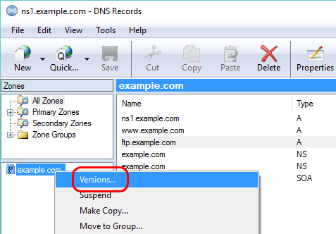
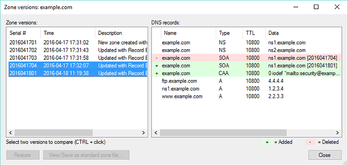
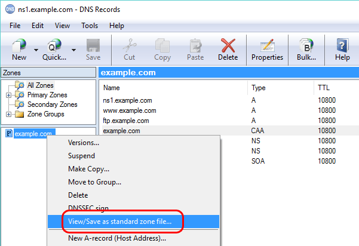
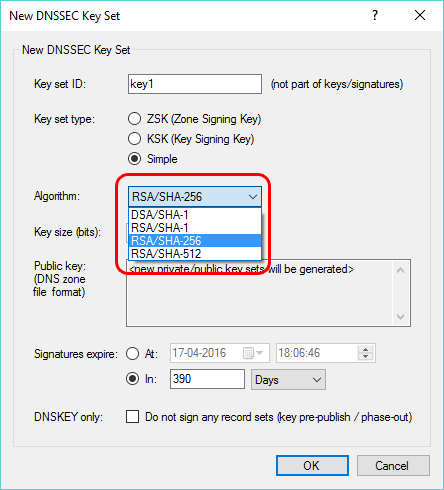
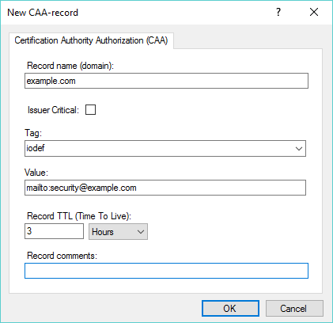

---
title: New in Simple DNS Plus (v. 6.0)
category: 17
frontpage: false
comments: true
vgroup: 7
vname: v. 6.0
vsort: 60
created-utc: 2019-01-01
modified-utc: 2019-01-01
---
<h3>Zone version control</h3>

Simple DNS Plus now stores a number of old versions of each zone (each version identified by a SOA-record serial number). 
This makes it easy to track changes and to restore a previous version if an update caused trouble. 
These stored versions are now also used to provide optimized incremental zone transfers (IXFR) to secondary servers (by calculating and&nbsp;sending only a single diff-set). 
New HTTP API functions &quot;zoneversions&quot; and &quot;getzoneversion&quot; have been added to list the stored versions of a zone and to retrieve the zone file text for a specific version (build 105 and later).

To view, compare, export, or restore old versions of a zone, in the DNS Records window, right-click a zone and select &quot;Versions...&quot;:

This opens the new&nbsp;&quot;Zone versions&quot; window. Select an old version (by serial number) to see the records of that version, or select two versions to compare them (hold down CTRL key while clicking versions). 
With a single version selected, click the &quot;Restore&quot; button to restore that&nbsp;version, or click the &quot;View/Save as standard zone file...&quot; to export it:

In the Options dialog there is a new&nbsp;DNS / Local Zones / Zone Versions section.&nbsp;Here you can specify the number of versions to retain.

<h3>All DNS data and program settings in single database file</h3>

Simple DNS Plus no longer stores DNS records in individual zone files. 
These and almost all other configuration files used by previous versions of Simple DNS Plus have been moved into a single SQLite database file - &quot;sdnsplus.db&quot; in the application data directory. 
Using the transactional features of the SQLite&nbsp;database engine, your data is now much better protected from power outages, crashes, etc. 
Also, DNS records are now stored in a binary format within this database, making loading and saving zones even faster.

We do <u>NOT</u> recommend that you update the new database file directly, but since it is a standard SQLite file, you can access / inspect it with any SQLite tool - for example&nbsp;&quot;SQLiteStudio&quot; (<a href="http://sqlitestudio.pl" target="_blank">http://sqlitestudio.pl</a>).

Note: We have also added a command line option (-b) to make a backup of this database while Simple DNS Plus is still running (build 102 and later). For details see <a href="/kb/50/how-do-i-backup-and-restore-simple-dns-plus-settings-and-data-v6-0-and-later">/kb/50/how-do-i-backup-and-restore-simple-dns-plus-settings-and-data-v6-0-and-later</a>

<h3>View/Save as standard zone file</h3>

As mention above, Simple DNS Plus no longer stores DNS records in standard zone files (RFC1035 format), but you can now easily generate such a file for any DNS zone in Simple DNS Plus. 
In the DNS Records window, right-click a zone&nbsp;and select &quot;View/Save as standard zone file&quot;:

This opens a new window&nbsp;with the text of a standard zone file for the DNS records currently listed in the DNS Records window. 
Click the &quot;Save as...&quot; button to save this to a file, or the &quot;Copy&quot; button to copy this text to the Windows clipboard:

<h3>Export standard boot file and zone files</h3>

You can now also export a standard boot file along with standard zone files for all the zones in Simple DNS Plus (or for the zones in one or more zone groups). The resulting files can easily be imported on another DNS server since everything is in standard RFC defined file formats. 
In the DNS Records window, from the &quot;File&quot; menu, select &quot;Export...&quot;, then select &quot;Standard boot file and zone files&quot;:

<h3>Export/import plug-in configuration</h3>

Typically plug-ins need to be configured the same way on primary and secondary servers, and some plug-ins have very complex configurations. 
It is now easy to copy a plug-in instance configuration&nbsp;from Simple DNS Plus on one server to another. 
In the plug-in instances dialog (also new in this version&nbsp;- see below), click the &quot;Export&quot; button. This will copy the configuration of the selected plug-in instance to the Windows clipboard (XML format). Then Remote Desktop into the other Simple DNS Plus server, and click the &quot;Import&quot; button there, and a new plug-in instance will be created there with the same settings:

<h3>SHA-256 and SHA-512 in DNSSEC signatures</h3>

These algorithms are more secure and now recommended over&nbsp;SHA-1:

<h3>SHA-256 and SHA-384 hashes&nbsp;in DNSSEC DS-records</h3>

These algorithms are more secure and now recommended over&nbsp;SHA-1:

<h3>CAA-records (Certification Authority Authorization)</h3>

&quot;Allows a DNS domain name holder to specify one or more Certification Authorities (CAs) authorized to issue certificates for that domain.&quot; (RFC 6844).

To create a new CAA-record, in the DNS Records window, right-click a zone, select &quot;Other new record&quot; and then &quot;CAA-record&quot;:

<h3>Miscellaneous</h3>

<ul>
	<li>HTTP API specification in Swagger / OpenAPI format, and Swagger UI for exploring and testing the HTTP API included (build 106 and later). <a href="https://simpledns.plus/news/47">Details</a>.</li>
	<li>The DNS Records module now sends record updates to the service as a diff-set rather than a full zone, solving problem with dynamic&nbsp;updates received while editing a zone being overwritten.</li>
	<li>Plug-in&nbsp;configuration moved from Options dialog to a separate dialog. A new &quot;Plug-Ins&quot; button on main tool bar and new menu item in main Tools menu were added to access this.</li>
	<li>Export Wizard / IP address to &quot;hosts&quot; or &quot;.csv&quot; file function - now also includes IPv6 addresses.</li>
	<li>Many performance optimizations.</li>
</ul>

<h3>Note about Adding / updating zones from command line</h3>

You may need to update any programs/scripts using the command line to add/update DNS zones in Simple DNS Plus.

Simple DNS Plus has since early versions included a command line option to add/update a DNS zone:

<pre>SDNSPLUS -z  z:&lt;zone-name&gt; [f:&lt;file-name&gt;] [p:&lt;primary-ip&gt;] [g:&lt;group-id&gt;]</pre>

In previous versions the zone file would be read from the directory specified in the Options dialog / DNS / Local Zones / Data Files section, but that settings is gone in v. 6.0 (because Simple DNS Plus now stores all DNS zones in a database instead of individual files). 
Therefore, for v. 6.0, we have updated the program so that you can now specify a full path in the f: parameter. For example:

<pre>SDNSPLUS -z  z:example.com &quot;f:C:\my zone files\example.com.dns&quot;</pre>

If you do NOT specify a full path in the f: parameter, Simple DNS Plus v. 6.0 will try to load the zone file from a &quot;ZoneFiles&quot; directory under the application data directory (typically &quot;c:\ProgramData\JH Software\Simple DNS Plus&quot;) - the default location for zone files in previous versions.

Note: This applies to primary zones only, as the f: parameter is not needed when adding/updating a secondary zone.

<h3>Retired features</h3>

<ul>
	<li>Alias zones (shared zone files). 
	This feature was not compatible with the new zone versions and single database features (see above), and it is easy to achieve the same thing using either an &quot;Alias Zones&quot; plug-in (see <a href="https://simpledns.plus/plugin-aliaszones" target="_blank">https://simpledns.plus/plugin-aliaszones</a>) or the &quot;ALIAS record&quot; feature (see <a href="/kb/2/alias-records-auto-resolved-alias" target="_blank">/kb/2/alias-records-auto-resolved-alias</a>)</li>
	<li>HTTP API commands &quot;addaliaszone&quot; and &quot;aliaszonelist&quot;. 
	Alias zones feature retired (see above). Using these commands now result in a &quot;404 Not Found&quot; response.</li>
	<li>HTTP API commands &quot;loadzone&quot; and &quot;reloadall&quot;. 
	Zones are no longer stored in individual files, so these are no longer relevant. Using these commands still result in a &quot;200 OK&quot; response - but do nothing.</li>
	<li>Options dialog / DNS / Local Zones / Data Files section (Location of DNS data files, Defer loading, record TTL limits). 
	Zones are no longer stored in individual files, so this is no longer relevant.</li>
	<li>Command line &quot;SDNSPLUS -r&quot; (reload all zones) . 
	Zones are no longer stored in individual files, so this is no longer relevant.</li>
	<li>Command line &quot;SDNSPLUS -o&quot; (reload options / &quot;sdnsplus.config.xml&quot; file). 
	Program options are no longer stored in an individual file, so this is no longer relevant.</li>
	<li>Main window / File menu / Reload DNS Records. 
	Zones are no longer stored in individual files, so this is no longer relevant.</li>
	<li>&quot;ZoneDBViewer.exe&quot; tool. 
	Simple DNS Plus no longer uses the proprietary boot&nbsp;file &quot;_zones.sdzdb&quot;, so there is no longer any need for this tool. See information above about using SQLite tools instead.</li>
	<li>Default Zone Values&nbsp;dialog / SOA record serial number format (date/sequential). 
	SOA serial number incrementation now always uses date format if such value is larger than the previous.</li>
	<li>Export Wizard / Zone list (.csv file export)</li>
	<li>Individual plug-in configuration files. 
	Plug-in interface &quot;PlugInTypeInfo.ConfigFile&quot; is now ignored.</li>
</ul>