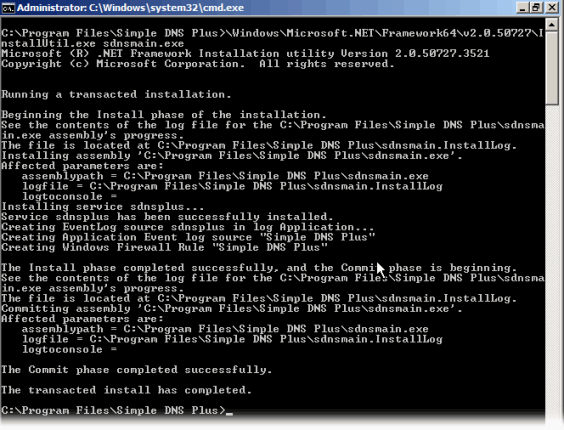
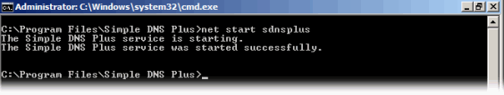
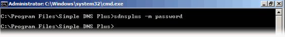

---
category: 11
frontpage: false
comments: true
refs: 84
created-utc: 2019-01-01
modified-utc: 2021-10-07
---
# Simple DNS Plus on Windows Server Core

"Server Core" is a command line only version of Windows Server 2008 and later - "Windows without windows".\
You can install and run the Simple DNS Plus service (v. 5.2 and later) on Server Core and manage this from another PC through the <a href="https://simpledns.plus/news/5">Remote Management</a> feature.

Simple DNS Plus v. 9.0 and later requires the .NET Framework 4.8 - included with recent Windows versions
(earlier versions of Simple DNS Plus require .NET Framework 2.0 which is included in Windows Server 2008 R2 Server Core).\

Installing Simple DNS Plus on Server Core requires several steps as described below.

First install Simple DNS Plus on a workstation PC (with full GUI version of Windows), then copy the directory where Simple DNS Plus was installed (typically "c:\program files\simple dns plus") to the same location on the Server Core computer. Technically you don't need the GUI based .exe files, but it is easier just to copy the whole directory.

Then on the Server Core computer, run the .NET "InstallUtil.exe" utility on "sdnsmain.exe".\
This will install the Simple DNS Plus service, eventlog source, and firewall rule:

Next start the Simple DNS Plus service by typing "net start sdnsplus":

And finally enable remote management by running "sdnsplus -m &lt;password&gt;":

 

Now you can connect to the Simple DNS Plus service from your workstation PC using the "Remote Management" shortcut in the Windows Start menu (or running "sdnsgui.exe -remote"):

 

You can now manage the Simple DNS Plus service on the Server Core computer just like a local instance of Simple DNS Plus.

A few tips on installing Server Core for the first time:

1) After you have installed Windows, you need to activate it. Since there is no GUI for this, you need to use the command lines:\
`slmgr /ipk xxxxx-xxxxx-xxxxx-xxxxx-xxxxx` (your registration key)\
and then\
`slmgr /ato`

2) To be able to copy files to the server, you may need to temporarily disable the Windows firewall:\
`netsh firewall set opmode mode=disable`