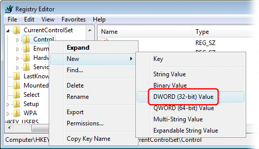
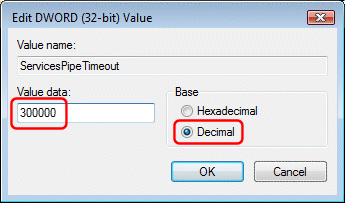

---
category: 14
frontpage: false
comments: true
created-utc: 2019-01-01
modified-utc: 2019-01-01
---
# Simple DNS Plus service fails to start on computer reboot

If the Simple DNS Plus service doesn't automatically start up after you start the computer, and you find error events in the Windows Event Log / Application log like this:

> "The Simple DNS Plus service failed to start due to the following error:  
> The service did not respond to the start or control request in a timely fashion"

and/or like this:

> "Timeout (30000 milliseconds) waiting for the Simple DNS Plus service to connect."

Then it may be because your computer is a just too busy at startup - for example if the computer is low on memory and begins swapping to disk.

By default the Windows Service Manager gives a service 30 seconds to start, and then it kills the service process assuming something is wrong.

You may be able to get around this issue by overriding the 30 second default with a higher value by setting a Windows registry key.

From the Windows Start menu, select "Run", type in "regedit" and click OK, and browse to

> HKEY_LOCAL_MACHINE\SYSTEM\CurrentControlSet\Control

If it is not already there, create a new DWORD value named "ServicesPipeTimeout":

Double click "ServicesPipeTimeout" and set the value to the number of milliseconds that the Windows Service Manager should wait for services to start. For example decimal 300000 (= 5 minutes):

