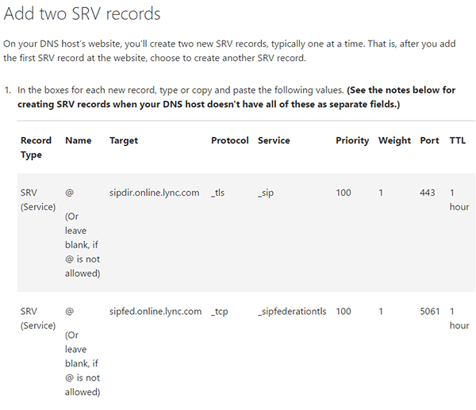
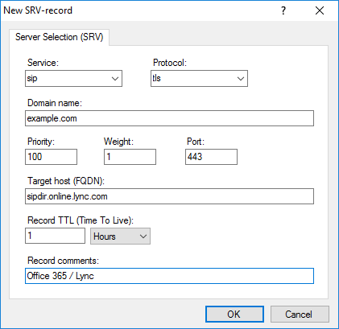
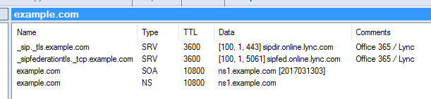

# SRV records for Office 365

At the Office 365 support website, there is an article about setting up DNS records for your domain name in connection with Office 365.

See <https://support.office.com/en-us/article/Create-DNS-records-at-any-DNS-hosting-provider-for-Office-365-7b7b075d-79f9-4e37-8a9e-fb60c1d95166>

The section about SRV-records (for Lync) can be a bit confusing because of the way and order in which the data fields are listed.

In Simple DNS Plus, adding these records would look like this:

> [!Note] The "Service" and "Protocol" fields are NOT locked to the drop-down choices. You can type any value into these.

And back in the record list:

