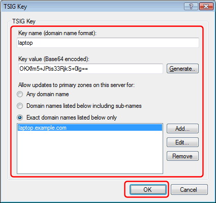
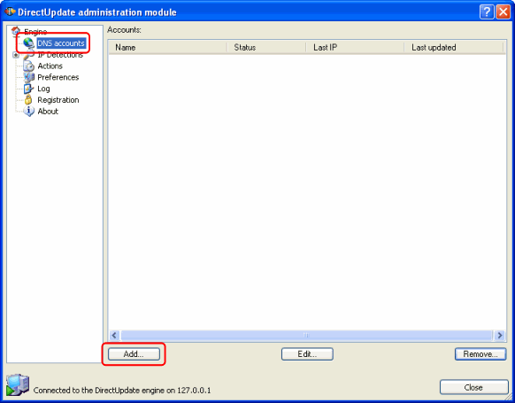
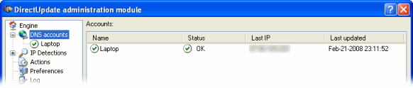
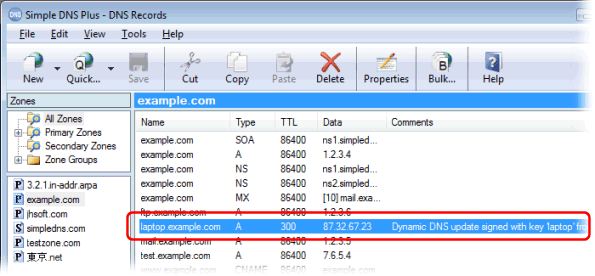

---
category: 4
frontpage: false
comments: true
refs: 35,127,80,40,173
created-utc: 2019-01-01
modified-utc: 2019-01-01
---
# Using DirectUpdate with Simple DNS Plus

NB: This article was written before we released the [DynDNS Service plug-in](https://simpledns.plus/plugin-dyndns).  
DirectUpdate can also be used with the DynDNS Service plug-in making it even easier to run a DynDNS service

DirectUpdate is a product by William Levra-Juillet - [http://www.directupdate.net](http://www.directupdate.net){target=_blank}

You can use DirectUpdate to automatically update DNS records on a remote Simple DNS Plus server. DirectUpdate will update the DNS records each time the IP address changes on the local computer.

This makes it possible to run different services (such as a web-server) on a computer with a dynamic IP address.  
You can also use this anytime you need to access roaming computers - for example traveling sales people with laptops.

In the following example, we have a roaming laptop with a dynamic IP address (currently 5.6.7.8) which we want to access using the domain name "laptop.jhsoft.com", and we are running a Simple DNS Plus server with the name of "ns1.example.com" on IP address 11.22.33.44 (static).

Step 1: First you need to setup a zone that will hold the DNS record for the laptop (the dynamic IP computer). See [this article](/kb/4/basic-dns-server-configuration-example). If you have already setup a zone for your domain name, you can use that.

Step 2: Next you need to setup a TSIG key (basically a user name / password pair) for the laptop.

In the main window of Simple DNS Plus, click the Options button:

In the Options dialog, under "DNS" select "TSIG Dynamic Updates", and click the "Add..." button:

Enter a key name, a key value, and specify which domain(s) the client with this key may update.  
The key name can be whatever you find convenient - for example the name of the client computer or the person using it.  
The key value is basically a binary password entered in base64 encoding. You can click the "Generate" button to automatically create a new random value of either 128, 256, or 512 bit length:

When done click the "OK" button, and also click the "OK" button in the previous dialog to save your settings.

Step 3: Setup DirectUpdate on the laptop.

After installing Directupdate, you need to add a new account to it.  
Right-click the tray icon and from the the pop-up menu select "Launch admin now..." to access to admin module:

In the "administration module", select "DNS accounts", and click the "Add..." button:

\- Select "Simple DNS Plus" from the "Account type" drop-down list.  
\- Un-check "Disable/ignore this account".  
\- Make sure "Perform updates using secure protocol" is checked.  
\- In IP Detection to use select "Default IP detection".  
\- In the "TSIG key name" fiield, copy the key name used in Simple DNS Plus.  
\- In the "TSIG secret" field, copy the key value used in Simple DNS Plus.  
\- In the "Domain / host" field, enter the host name you want to update.  
\- In the "Server" field, enter the host name or IP address of your Simple DNS Plus server.

When everything is setup correctly, DirectUpdate will now update Simple DNS Plus.  
If you select "DNS accounts", you should see the Status as "OK":

And you can see the new/updated record in Simple DNS Plus:

