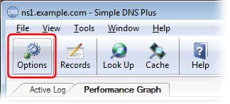
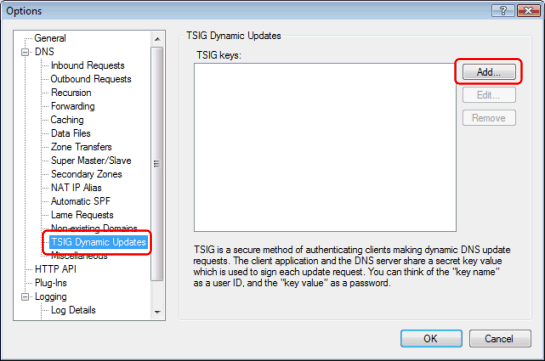
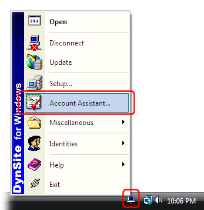
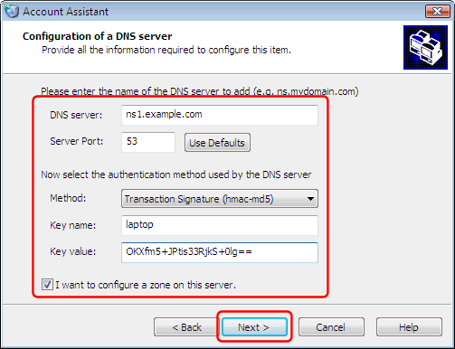
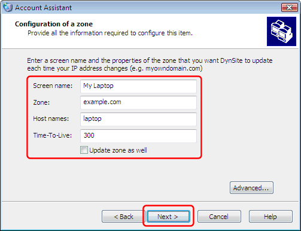
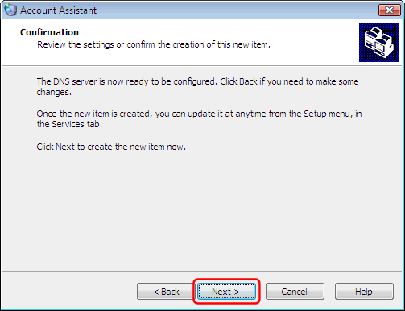
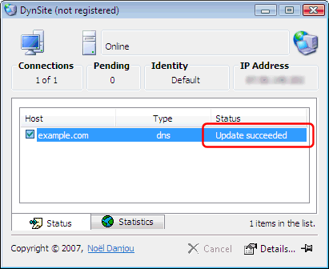

---
category: 4
frontpage: false
comments: true
refs: 35,125,80,40,173
created-utc: 2019-01-01
modified-utc: 2019-01-01
---
# Using DynSite with Simple DNS Plus

NB: This article was written before we released the [DynDNS Service plug-in](https://simpledns.plus/plugin-dyndns).  
DynSite can also be used with the DynDNS Service plug-in making it even easier to run a DynDNS service

DynSite is a product from Noël Danjou - [http://noeld.com/dynsite.asp](http://noeld.com/dynsite.asp){target=_blank}

You can use DynSite to automatically update DNS records on a remote Simple DNS Plus server. DynSite will update the DNS records each time the IP address changes on the local computer.

This makes it possible to run different services (such as a web-server) on a computer with a dynamic IP address.  
You can also use this anytime you need to access roaming computers - for example traveling sales people with laptops.

In the following example, we have a roaming laptop with a dynamic IP address (currently 5.6.7.8) which we want to access using the domain name "laptop.example.com", and we are running a Simple DNS Plus server with the name of "ns1.example.com" on IP address 11.22.33.44 (static).

Step 1: First you need to setup a "example.com" zone that will hold the DNS record for the laptop (the dynamic IP computer). See [this article](/kb/4/basic-dns-server-configuration-example). If you have already setup a zone for your domain name, you can use that.

Step 2: Next you need to setup a TSIG key (basically a user name / password pair) for the laptop.

In the main window of Simple DNS Plus, click the Options button:

In the Options dialog, under "DNS" select "TSIG Dynamic Updates", and click the "Add..." button:

Enter a key name, a key value, and specify which domain(s) the client with this key may update.  
The key name can be whatever you find convenient - for example the name of the client computer or the person using it.  
The key value is basically a binary password entered in base64 encoding. You can click the "Generate" button to automatically create a new random value of either 128, 256, or 512 bit length:

When done click the "OK" button, and also click the "OK" button in the previous dialog to save your settings.

Step 3: Setup DynSite on the laptop.

After installing DynSite, you need to add a new account for the Simple DNS Plus server to it.  
The first time you run DynSite, the startup wizard eventually takes you to the "Account Assistant".  
If you are already running DynSite, you can invoke the "Account Assistant" by right clicking on the DynSite tray icon and selecting "Account Assistant" from the pop-up menu:

Click the "Next" button in the first page of the "Account Assistant":

Select server type "DNS Servers", and click the "Next" button:

Select "Configure a new DNS server", enter the name of the DNS server, and click the "Next" button:

In the "DNS server" field, enter the domain name or IP address of your Simple DNS Plus server.  
In the "Server Port" field, enter "53"  
In the "Method" field, select "Transaction Signature (hmac-md5)"  
In the "Key name" field, copy the key name used in Simple DNS Plus.  
In the "Key value" field, copy the key value used in Simple DNS Plus.  
Make sure "I want to configure a zone on this server" is checked, and click the "Next" button:

In the "Screen name" field, enter the full domain name of the client computer.  
In the "Zone" field, enter the name of the zone where you want the DNS record in Simple DNS Plus.  
In the "Host names" field, enter the first segment of the client computer domain name.  
In the "Time-To-Live" field, enter the number of seconds that this record may be cached by other DNS servers. Whenever your IP address changes, this value determines how long it takes before all of the Internet once again can reach you through the domain names. We recommend using 300 (5 minutes) or less.  
Make sure "Update zone as well" is NOT checked, and click the "Next" button:

Click the "Next" button, and then the "Finish" button on the following pages:

When everything is setup correctly, DynSite will now update Simple DNS Plus:

And you can see the new/updated record in Simple DNS Plus:

