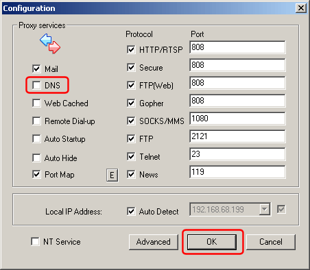

---
category: 6
frontpage: false
comments: true
refs: 56
created-utc: 2019-01-01
modified-utc: 2019-01-01
---
# Using Simple DNS Plus with CCProxy

CCProxy a product from Youngzsoft - [http://www.youngzsoft.net](http://www.youngzsoft.net){target=_blank}

CCProxy includes a DNS proxy or mapping function used to relay DNS requests from clients behind the proxy server.  
If CCProxy and Simple DNS Plus are running on the same computer, this will conflict as both programs are trying to use port 53.

You can disable the DNS function in CCProxy. You won't need this because Simple DNS Plus provides this functionality directly.

In CCProxy click the Options button:

Un-check "DNS" and click the "OK" button:

After changing this setting, you should be able to start the DNS service in Simple DNS Plus (select "Start Server" from the "File" menu).

