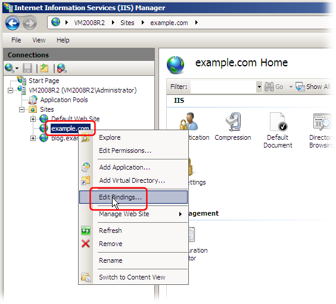
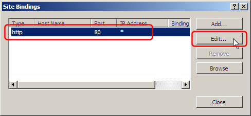
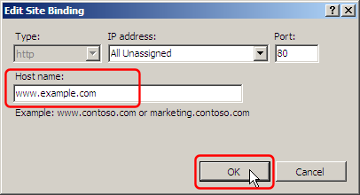

# Virtual hosting with IIS (Internet Information Services) (IIS 7.0 (Windows Vista / Server 2008) and later)

"Virtual hosting" means hosting multiple web-sites with different domain names on the same IP address.

From the "Internet Information Services (IIS) Manager" window, right click on a web-site, and select "Edit Bindings...":

In the "Site Bindings" dialog, select the first item, and click the "Edit" button:

Enter the web-site domain name in the "Host name" field:

Click the OK button in all the dialogs to save your changes.

Create additional web sites the same way.

