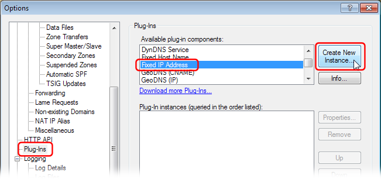
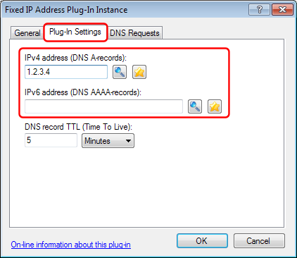
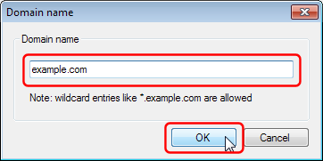
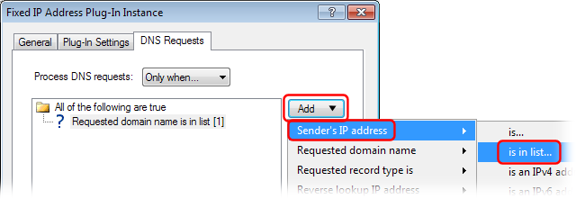
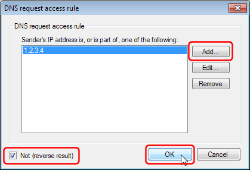

---
category: 8
frontpage: false
comments: true
created-utc: 2019-01-01
modified-utc: 2019-01-01
---
# Web-site domain filtering using the "Fixed IP Address" plug-in

This article describes a simple way to block access to a few web-sites (and make an exception for the manager's PC) using the "Fixed IP Address" plug-in.  
To block a longer list of sites we recommend using the more advanced [Domain Blacklist plug-in](https://simpledns.plus/plugin-domainbl).

In the Simple DNS Plus main window,click the "Options" button:

In the "Options" dialog "Plug-ins" section under "Available plug-in components", select "Fixed IP Address" and click the "Create New Instance" button:

In the "Fixed IP Address Plug-In Instancd" dialog, select the "Plug-in Settings" tab, and enter the IP address(es) of the web-server that you want to redirect requests for blocked web-sites to - or enter a dummy address to have blocked requests fail:

Under the "DNS Reqests" tab, in the "Process DNS requests" drop-down select "Only when...". Click the "Add" button, select "Requested domain name" and "is in list...":

In the "DNS reqest access rule" dialog, click the "Add..." button:

Enter a web-site domain name that you want to block and click the "OK" button.  
Repeat this for each domain name that you wish to block.

Next, if you want to exclude some client IP addresses (like the manager's PC) from the block, back in the "Fixed IP Address Plug-In Instance" dialog, click the "Add" button, select "Sender's IP address" and "is in list...":

In the "DNS requst access rule" dialog add an IP address for each client PC IP address that you don't want to block, make sure to check the "Not (reverse result" checkbox:

Back in the "Fixed IP Address Plug-In Instance" dialog, you should now have two "rules" - one to list the blocked domain names and one to list the IP addresses which should not be blocked:

Click the "OK" button here and in the "Options" dialog to save.  
