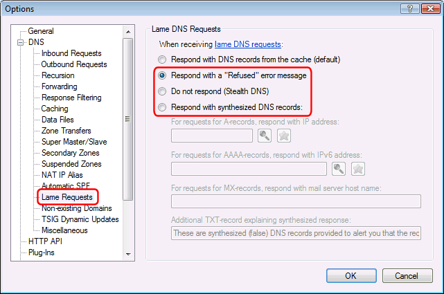
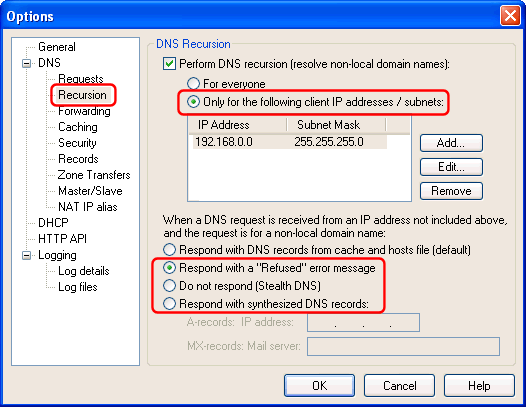

---
category: 7
frontpage: false
comments: true
created-utc: 2019-01-01
modified-utc: 2019-01-01
---
# What is "DNS cache snooping" and how do I prevent it?

DNS cache snooping is when someone queries a DNS server in order to find out (snoop) if the DNS server has a specific DNS record cached, and thereby deduce if the DNS server's owner (or its users) have recently visited a specific site.  
This may reveal information about the DNS server's owner, such as what vendor, bank, service provider, etc. they use. Especially if this is confirmed (snooped) multiple times over a period.  
This method could even be used to gather statistical information - for example at what time does the DNS server's owner typically access his net bank etc. The cached DNS record's remaining TTL value can provide very accurate data for this.

DNS cache snooping is possible even if the DNS server is not configured to resolve recursively for 3rd parties, as long as it provides records from the cache also to 3rd parties (a.k.a. "lame requests").

The good news is that it is easy to prevent this with Simple DNS Plus:

**1) Make sure recursion is restricted to your own IP address range (or disabled completely).**

This is done in the Options dialog / DNS / Recursion section:

**2) Configure Simple DNS Plus NOT to answer lame DNS requests from the cache.**

<u>Simple DNS Plus version 5.1 build 113 and later:</u>

No additional configuration needed.  
Simple DNS Plus will not respond with records from the cache to any IP address not in the recursion list (above) no matter which lame DNS requests option is used.

<u>Simple DNS Plus version 5.0 to 5.1 build 112:</u>

Select an option other than "Respond with DNS records from the cache" in the Options dialog / DNS / Lame DNS Requests section:

<u>Simple DNS Plus v. 4.00.xx and earlier:</u>

Select an option other than "Respond with DNS records from cache and hosts file" in the Options dialog / DNS / Recursion section:

