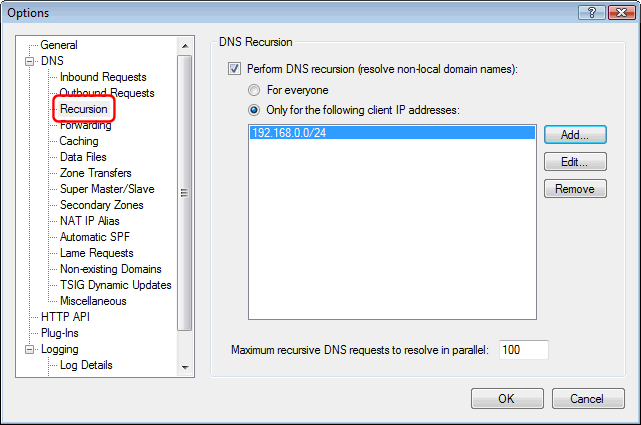

---
title: What is an ”open DNS server” and how do I fix it?
category: 7
frontpage: false
comments: true
created-utc: 2019-01-01
modified-utc: 2019-01-01
---

An open DNS server is a DNS server which is willing to resolve recursive DNS lookups for anyone on the Internet. 
This is similar to the better known &ldquo;open relay&rdquo; term used about mail servers which will forward e-mails (including spam and viruses) for anyone.

When a DNS server resolves a recursive DNS lookup, it tracks down information about a domain name hosted on some other DNS server somewhere else on the Internet (a recursive process involving several other DNS server). 
This DNS server feature is one of the corner stones of the whole Internet idea and is relied upon by all Internet client applications such as browsers and e-mail clients.

Unfortunately hackers have also found this feature useful in performing a special type of DDoS attack called a &ldquo;DNS Amplification Attack&rdquo;. 
The concept of this attack is that a hacker sends a recursive DNS query via UDP with a spoofed from-IP-address in the IP packet header to some DNS server. This DNS server then sends a DNS response packet back, not to the hacker, but to the spoofed IP address. This DNS response packet may be many times larger than the DNS query packet, and this way the DNS server amplifies the traffic sent to the victim.

A recursive request also requires a lot more processing by the DNS server compared to a non-recursive request.  
So it is important to configure Simple DNS Plus to only perform recursion for trusted clients. You can configure this in the Options dialog / DNS / Recursion section:

 

IMPORTANT: For programs like browsers and e-mail clients to work, they must have access to a DNS server that offers recursion. Therefore local computers (including the server itself on 127.0.0.1 and local IP addresses) should always be offered recursion. 

To prevent your own / client IP addresses from being attacked, you should also make sure that your firewall blocks incoming packets with from-IP-addresses in your own IP range and private IP ranges (such packets are obviously spoofed).

Even with DNS recursion limited to trusted clients or completely turned off, a DNS server could still be exploited to send traffic to a spoofed IP address as part of a DDoS attack, though not as effective as with recursion. 
This can be prevented using Simple DNS Plus' unique option not to respond to requests for non-local domains from clients not offered recursion (lame requests):

NOTE: There is one significant limitation to the effectiveness of attacks exploiting open DNS servers, which may be the reason why these attacks haven&rsquo;t been seen much yet: 
Most ISPs and Internet back-bone operators today are blocking (or should be blocking) outgoing IP packets with spoofed from-IP addresses. 
This is a very simple filter on any firewall (from-IP not in our range &gt; drop packet). 
Therefore it is not possible to launch such an attack from an Internet connection provided by any serious ISP (or use bots on any such connections).
