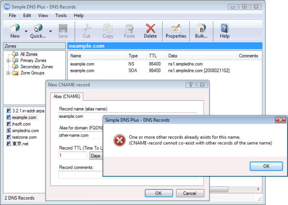

# Why can't I create a CNAME record for the zone name itself?

A CNAME-record cannot exist with any other records for the same name, because a name cannot both be an alias (CNAME) and something else at the same time.

From [RFC1912](http://www.rfc-editor.org/rfc/rfc1912.txt) section 2.4:  

> "A CNAME record is not allowed to coexist with any other data."

If you try to create a CNAME-record for the name of the zone itself, you will always encounter this conflict because a zone always has at least a SOA-record and typically one or more NS-records with the zone name:

Instead of the CNAME-record, you can setup an A-record pointing directly to the IP address of whatever server the aliased name is pointing to.

Or you can use an [ALIAS-record](/kb/2/alias-records-auto-resolved-alias) which is similar to CNAME but doesn't have the problem mentioned above.

> [!Note] While certain other DNS servers may allow you to configure such a CNAME-record, it is still an error to do so.
> The results of this are unpredictable, and often causes serious problems because in some situations the CNAME-record will override other critical records at the zone root level - for example hiding the NS- and SOA-records.