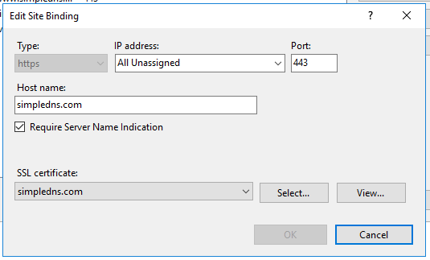
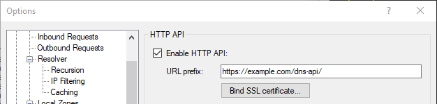

# How to bind an SSL certificate to the HTTP API

Simple DNS Plus v. 7.0 and later support using SSL with the HTTP API.

The HTTP API uses the [Windows HTTP Server API](https://msdn.microsoft.com/en-us/library/windows/desktop/aa364434(v=vs.85).aspx) allowing it to share IP / port / host name with IIS web-sites and other programs on the same computer. This also means that SSL must be setup at the system level rather than in Simple DNS Plus itself.

The easiest way to setup SSL for the Simple DNS Plus HTTP API is if you are also running your SSL based web-site on IIS on the same computer. 

In this scenario you setup the web-site for SSL in IIS as normal:



And then simply configure the Simple DNS Plus HTTP API to use a sub-path of the same site:



This way you don't need to do anything else to enable SSL.

---

If above does not match your setup, you will need to bind an SSL certificate to the ip / host name and port number used by the HTTP API.

Note that the easiest way to obtain an SSL certificate might still be through IIS (on this or another computer). Once the certificate is obtained, you can export it (including the private key) as a .pfx file, and import it on the computer running Simple DNS Plus (using the Certificates snap-in in MMC - see below).

In **Simple DNS Plus v. 9.0 and later**, you can use the "Bind SSL certificate" button below the URL prefix for this.

In **earlier versions of Simple DNS Plus**, you will need to use the "netsh" command line utility:

Once you have the SSL certificate on the computer, you need to find the hash / thumb-print value for the certificate. You do this by locating the certificate in the Certificates snap-in in MMC, and then copying the thumb-print value.

To do that, follow these steps:

- Open a Command Prompt window as Administrator.
- Type `mmc` and press the <kbd>ENTER</kbd> key.
- On the File menu, click Add/Remove Snap In.
- In the Add or Remove Snaps-ins dialog box, select Certificates.
- Click Add.
- In the Certificates snap-in dialog box, select Computer account and click Next.
- In the Select Computer dialog box, click Finish.
- In the Add or Remove Snap-ins dialog box, click OK.
- In the Console Root window, click Certificates (Local Computer) to view the certificate stores for the computer.
- Locate the certificate you need - typically under Personal / Certificates.
- Double click the certificate to open it.
- Select the "Details" tab.
- Scroll down and click the "Thumbprint" field.
- Select and copy the value.
- If the value contains spaces, you need to remove these so that you get one continuous string.


Next you need to open a command prompt as Administrator and type:

If you want to bind the certificate to a hostname / port:

```
netsh http add sslcert hostnameport=simpledns.plus:443 certhash=99111b9ba1d6146e5efc3353c199b72f13171d71 appid={64813f3e-afe6-4426-ba50-1b56091064c6} certstorename=MY
```

If you want to bind the certificate to an IP address / port:

```
netsh http add sslcert ipport=127.0.0.1:443 certhash=99111b9ba1d6146e5efc3353c199b72f13171d71 appid={64813f3e-afe6-4426-ba50-1b56091064c6}
```

The value following `certhash=` is the thumbprint value you obtained above.

The value following `appid=` is a random value identifying this binding. We suggest using {64813f3e-afe6-4426-ba50-1b56091064c6} as in the samples above - this way it easy to spot the Simple DNS Plus HTTP API binding if you return to this documentation later on.


For more in-depth information on this, the following articles might be useful:

- <https://docs.microsoft.com/en-us/dotnet/framework/wcf/feature-details/how-to-view-certificates-with-the-mmc-snap-in>
- <https://docs.microsoft.com/en-us/dotnet/framework/wcf/feature-details/how-to-configure-a-port-with-an-ssl-certificate>
- <http://blog.boxofbolts.com/ssl/windows/owin/guide/2015/06/29/https-self-hosted-windows>