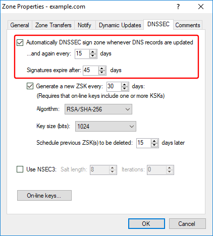
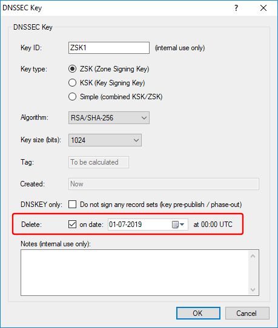
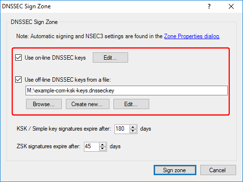
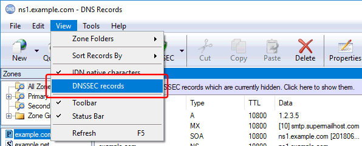

---
category: 17
frontpage: false
comments: true
vgroup: 7
vname: v. 8.0
vsort: 80
created-utc: 2019-01-01
modified-utc: 2019-01-01
---
# New in Simple DNS Plus (v. 8.0)

This version update is primarily about new DNSSEC features. For an overview of DNSSEC concepts such as "KSK", "ZSK" and "key rollovers", please see <https://simpledns.plus/help/definition-dnssec>.

We have also updated the KB article [How to DNSSEC sign a zone](https://simpledns.plus/kb/65) with step-by-step instructions on using these new DNSSEC features.

New features in v. 8.0:

- [Automatic DNSSEC signing](#autosign)
- [Automatic DNSSEC ZSK rollover](#zskroll)
- [On-line DNSSEC keys](#onlinekeys)
- [Scheduled automatic deletion of on-line DNSSEC keys](#autodelkey)
- [Combining on-line and off-line DNSSEC keys](#combokeys)
- [New function to remove/disable DNSSEC for a zone](#remove)
- [DNSSEC records hidden in GUI](#hidden)
- [New HTTP API commands for DNSSEC](#httpapi)
- [Miscellaneous](#misc)
- [Retired](#retired)

### Automatic DNSSEC signing{#autosign}

Simple DNS Plus can now automatically DNSSEC sign a zone whenever records in the zone are updated - or a specified number of days passes. This works with any kind of record update - including GUI, Bulk Update Wizard, HTTP API (v. 1 and 2), command line, dynamic DNS updates, updates from plug-ins, etc.

DNSSEC signing a zone is a CPU intensive operation, so we have programmed it so that this always happens on a separate CPU thread. This way it should not interfere much with the general performance of Simple DNS Plus - as long as you have at least two CPU cores. Of course most computers today have this, but this might be something to consider if you run Simple DNS Plus on a virtual machine.

Automatic DNSSEC signing is configured in the Zone Properties dialog for each zone:

### Automatic DNSSEC ZSK rollover{#zskroll}

As part of the automatic DNSSEC signing, Simple DNS Plus can also do automatic ZSK rollovers (add a new key and remove the old).

It is recommended (in RFCs and by various security experts) that DNSSEC keys are replaced periodically.
Generally KSKs should be replaced every few years and ZSKs every few months.

During a rollover, both the old and the new key should be present (and zone signed with both) for a short period allowing old keys to time out in caches etc.

### On-line DNSSEC keys{#onlinekeys}

DNSSEC keys can now also be stored "on-line" - that is - in the Simple DNS Plus database along with zone data (older versions only stored DNSSEC keys in separate key files - "off-line").

Storing DNSSEC keys on-line is required for automatic DNSSEC signing (see above), and it simplifies key management.

On-line keys can be exported to a DNSSEC key file (compatible with older versions of Simple DNS Plus), and off-line keys in a DNSSEC key file can be imported. These export/import functions can also be used to move on-line keys between Simple DNS Plus servers.

### Scheduled automatic deletion of on-line DNSSEC keys{#autodelkey}

On-line keys can be scheduled for automatic deletion (only works when automatic signing is enabled and KSKs are on-line).\
This is useful for example if you are doing a KSK rollover. You simply add the new KSK and schedule the old KSK to be deleted 2 weeks later. This way you don't have to touch this again until the next KSK rollover.

This feature is also used internally by the automatic DNSSEC ZSK rollover feature (see above).

### Combining on-line and off-line DNSSEC keys{#combokeys}

Storing DNSSEC keys on-line is convenient, but is also less secure than if the keys were stored off-line away from the server. Of course, it is not possible to do automatic signing without keys being available on-line.

As a compromise, it is possible to use a combination of on-line and off-line keys:

With a KSK/ZSK setup, the KSKs are only needed whenever keys are added or removed, and when previous KSK signatures are about to expire (to sign the DNSKEY records). By storing KSKs off-line (in a key file) and ZSKs on-line, Simple DNS Plus can still automatically sign the zone whenever records are updated. And you only need to get out the key file with the KSKs when doing key maintenance. This setup allows for storing KSKs away from the server - for example on an encrypted USB drive.

This does however prevent automatic ZSK rollover and scheduled key deletion (not possible without on-line KSKs).

### New function to remove/disable DNSSEC for a zone{#remove}

### DNSSEC records hidden in GUI{#hidden}

A DNSSEC signed zone contains a LOT of extra records (DNSKEY, RRSIG, NSEC, etc.) which tend to get in the way when you want to inspect or edit the zone.
Therefore these DNSSEC records are now hidden by default.

You can show the DNSSEC records by clicking the blue DNSSEC information bar:

Or show / hide them using the View menu / "DNSSEC records" function:

### New HTTP API commands for DNSSEC{#httpapi}

It is now also possible to DNSSEC sign zones and manage DNSSEC keys (on-line keys only) through the HTTP API:

- To DNSSEC sign a zone using the on-line DNSSEC keys (for zones NOT configured to sign automatically):\
  `POST /zones/{zonename}/dnssecsign`
- To retrieve a list of on-line DNSSEC keys for a zone:\
  `GET /zones/{zonename}/dnsseckeys`
- To retrieve a specific on-line DNSSEC key:\
  `GET /zones/{zonename}/dnsseckeys/{keyid}`
- To create a new or update an existing on-line DNSSEC key:\
  `PUT /zones/{zonename}/dnsseckeys/{keyid}`
- To delete an on-line DNSSEC key:\
  `DELETE /zones/{zonename}/dnsseckeys/{keyid}`
- To generate a list of DS-records (for inclusion in parent zone) based on the DNSKEY-records in the zone:\
  `GET /zones/{zonename}/dnssecds`
  
  
To retrieve / update the settings for a zone - including the new DNSSEC and auto signing settings - use the existing commands: `GET/PUT /zones/{zonename}`
  
Explore the full HTTP API including the new DNSSEC commands above at <https://simpledns.plus/swagger-ui>  

Note: The DNSSEC key information provided through the HTTP API does NOT include the private cryptographic key data of the DNSSEC keys - only meta data about them.

### Miscellaneous{#misc}

- **New "Versions" and "DNSSEC" buttons in DNS Records window toolbar**

    For easier access to the "Zone Versions" dialog and DNSSEC functions:

    

- **Each DNSSEC key (on-line and off-line) now has a "Notes" field**

    This can be used to record internal comments about the key. Available both via GUI and HTTP API.

- **New warning event 801 "Failed to automatically DNSSEC sign zone"**

    If enabled in the Options dialog / Logging / Windows Event Log section, Simple DNS Plus writes this event to the Windows Event log (see Windows Control Panel / Administrative Tools / Event Viewer) if it cannot automatically DNSSEC sign a zone
    (You can use the Windows Event Log to run scripts/programs, send e-mail notifications, or perform other actions whenever a specific event occurs through the Windows Task Scheduler).

- **Added checks for DNSSEC / ALIAS records conflict**

    Zones containing ALIAS records cannot be DNSSEC signed.

- **Moved function to generate DNSSEC DS-records (for inclusion in parent zone)**

    This function, which used to be part the "DNSSEC Sign Zone" dialog, has been moved to the DNSSEC dropdown button / menus.

- **Moved DNSSEC NSEC3 settings**

    These settings, which used to be in the "DNSSEC Key File" dialog, have been moved to the "Zone Properties" dialog / DNSSEC tab.

- **Moved DNSSEC signature expiration time field**

    This setting, which used to in the "DNSSEC Key" dialog, has been moved to the DNSSEC Sign Zone dialog and Zone Properties dialog / DNSSEC tab / automatic DNSSEC signing.
    And signatures are now set to expire at a date/time relative to the time of signing instead of a fixed date/time.

- **Moved SOA-record properties to separate dialog**

    This used to be part of the Zone Properties dialog.

- **Zone Properties dialog settings now saved immediately / Save button dedicated to DNS records**

    Changes to settings in the Zone Properties dialog used to be saved only after the "Save" button in the DNS Records windows was clicked.
    That "Save" button is now dedicated to saving records only.

- **Deprecated command line options -Z and -U**
    
    These options can be used to add/update/remove zones at the command line / through batch scripting.\
    We recommend using the HTTP API instead. The HTTP API can also be accessed from the command line or through batch scripting - for example using cURL (<https://curl.haxx.se>).\
    These command line options will be removed in a future version of Simple DNS Plus.

### Retired{#retired}

- **Retired option to password protect / encrypt keys in DNSSEC key files**

    This option was primarily intended as a way to provide different security levels for KSKs and ZSKs - for example so that an assistant could do the day-to-day ZSK signing, while only a manager with the KSK password could do KSK signing.\
    This is now better achieved using a combination of off-line and on-line keys as described above.\
    If you want to secure the off-line keys, store key files on a hardware encrypted USB drive, or a regular USB drive in combination with something like [VeraCrypt](https://www.veracrypt.fr/en/Home.html). And of course, only connect the drive while signing.\
    This version of Simple DNS Plus is still able to open / import password protected keys from key files originating from older versions. 

- **Retired option to use / modify DNSSEC key files stored on the server from a remote connection**

    This option is no longer needed with the new on-line DNSSEC keys feature. Existing DNSSEC keys files can be imported as on-line keys.