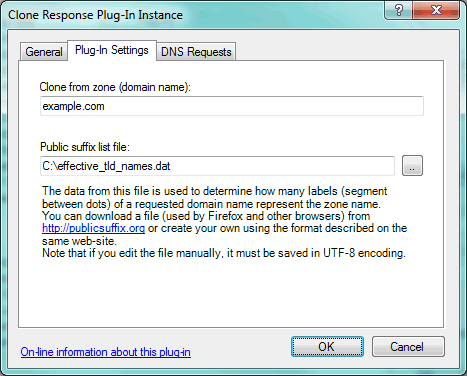

---
category: 8
frontpage: false
comments: true
refs: 110
created-utc: 2019-01-01
modified-utc: 2021-10-28
---
# Clone Response plug-in

This plug-in provides DNS responses by cloning the DNS records from a response to requests for another specified domain name.

This is an easy way to host many domain names that have the exact same records (except for their zone names).

On the "Plug-In Settings" tab, enter the following settings (explained below the image):

- **Clone from zone**  
The zone name to query for a response to be cloned.
- **Public suffix list file**  
File containing list of domain name suffixes under which domain names can be registered on the Internet.  
The data from this file is used to determine how many labels (segment between dots) of a requested domain name represents the zone name.  
You can download a file (used by Firefox and other browsers) from [http://publicsuffix.org](http://publicsuffix.org) or create your own using the format described on the same web-site.  
Note that if you edit the file manually, it must be saved in UTF-8 encoding.

When this plug-in processes a DNS request, it first determines what zone name the requested name belongs to.  
This will be the longest match in the public suffix list file + one more label of the requested name.  
Then a new DNS request is generated for the requested domain name less the zone name + the "clone from zone" name.  
This new request is then resolved (from local zones, other plug-ins, resolved from Internet, etc.) and the resulting response is cloned - replacing all instances of the "clone from zone" name with the zone name part of the requested name.

For example, say the configured "clone from zone" name is "example.com" and the plug-in receives a DNS request for "host5.simpledns.co.uk".  
Assuming the longest match for "host5.simpledns.co.uk" in the public suffix list file is "co.uk", then the zone name is determined to be "simpledns.co.uk".  
A new request is generated for "host5.example.com" ("host5.simpledns.co.uk" less "simpledns.co.uk" + "example.com").  
When this new request is resolved, all instances of "example.com" in the response are replaced with "simpledns.co.uk" so that this matches the original request.

IMPORTANT: By default this plug-in clones DNS responses for ALL DNS requests, so (unless this is what you want) it is important that it be limited in scope using the "DNS Requests" tab.

