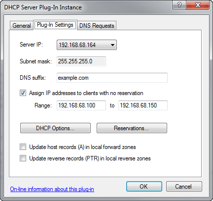
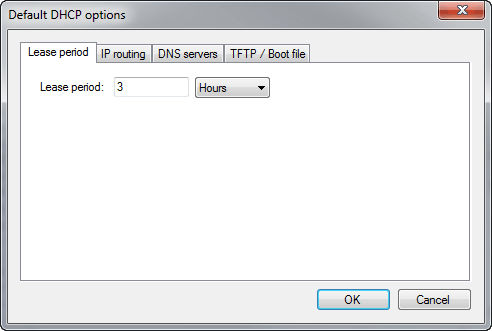
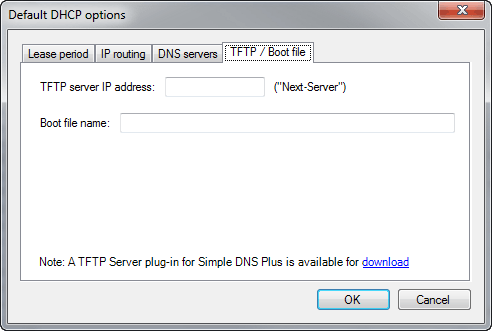
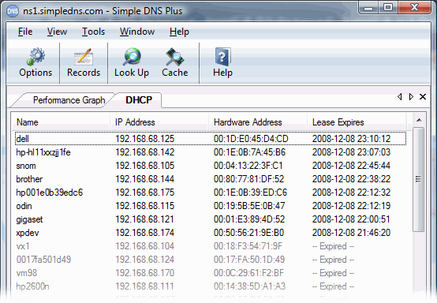

---
title: DHCP Server plug-in
category: 8
frontpage: false
comments: true
refs: 110
created-utc: 2019-01-01
modified-utc: 2021-10-29
---

This plug-in is a DHCP server which provides IPv4 addresses and settings to local computers and devices. The DHCP data is also used to serve DNS requests (forward and reverse) making it very simple to locate any local DHCP client by name on a local network.

On the &quot;Plug-In Settings&quot; tab, enter the DHCP settings to be used (explained below):

 
<ul>
	<li><strong>Server IP</strong> 
	Select which local IP address you want to serve DHCP on.</li>
	<li><strong>Subnet mask</strong> 
	Shows the IP subnet mask for the selected server IP address. 
	This subnet mask will automatically be provided to DHCP clients.</li>
	<li><strong>DNS suffix</strong> 
	The DNS suffix domain name assigned the DHCP clients. 
	(Client's full domain name in DNS will be &lt;machine name&gt;.&lt;DNS suffix&gt;)</li>
	<li><strong>Assign IP addresses to clients with no reservation</strong> 
	Specify the range of IP addresses (a.k.a. &quot;DHCP scope&quot;) to dynamically assign IP addresses to DHCP clients from.</li>
	<li><strong>DHCP Options...</strong> 
	Click this button to configure default DHCP options (see below).</li>
	<li><strong>Reservations...</strong> 
	Click this button to configure DHCP reservations (see below).</li>
	<li><strong>Update host records (A) in local forward zones</strong> 
	When checked, Simple DNS Plus will create/update an A-record for each new/updated DHCP lease. 
	Requires a local forward primary zone for the DNS suffix or a parent name. 
	This is only needed if you have multiple DNS servers hosting the DNS suffix and you want A-records for the DHCP leases automatically transferred to secondary DNS servers.</li>
	<li><strong>Update reverse records (PTR) in local reverse zones</strong> 
	When checked, Simple DNS Plus will create/update a PTR-record for each new/updated DHCP lease. 
	Requires a local reverse primary zone for the IP addresses assigned by the DHCP service. 
	This is only needed if you have multiple DNS servers hosting reverse DNS for the IP address range and you want PTR-records for the DHCP leases automatically transferred to secondary DNS servers.</li>
</ul>

<h3>DHCP Options dialog</h3>

The DHCP Options dialog can be accessed in 3 ways - from the main DHCP Plug-in dialog (see above) for setting the default options or from the DHCP Lease dialog (see) - either as options for a single lease or as options for a group of leases.

<ul>
	<li><strong>Lease Period tab</strong> 
	Specify how long DHCP clients are allowed to use their assigned IP address. 
	This is the maximum time the client computer may use the IP address without getting the lease renewed. 
	Typically after half the lease period has elapsed, the client computer will attempt to renew the lease. 
	 
	 
	 </li>
	<li><strong>IP routing tab</strong> 
	Specify the default gateway IP address (typically your Internet router) and/or static routing table entries to assign to DHCP clients: 
	 
	 
	 </li>
	<li><strong>DNS servers tab</strong> 
	Specify the DNS servers to assign to DHCP clients: 
	 
	 
	 </li>
	<li><strong>TFTP / Boot file tab</strong> 
	These options are typically used in combination with a <a href="https://simpledns.plus/plugin-tftp">TFTP server</a> to enable PXE / disk less booting of PCs, provisioning IP phones, etc. 
	An example of this is provided in <a href="http://simpledns.plus/kb/73">KB1304 - How to serve a network based Debian Linux installation with Simple DNS Plus</a>. 
	 
	</li>
</ul>

<h3>DHCP Reservations dialog (list of reservations)</h3>

Reserve IP addresses for specific clients based on computer/device name or hardware address (network card MAC address). 
To determine a computers hardware address on Windows NT4/2000 and later, run &quot;IPCONFIG /ALL&quot; from a command prompt, and see &quot;Physical Address&quot;.

 
<h3>DHCP Reservation dialog (individual reservation)</h3>

For each reservation, you can specify an alternate set of options - either for the individual reservation or for a group of reservations. 
For MAC based reservations, you can optionally specify a host name that will be assigned to the client (through the DHCP response and in local DNS data).

 
<h3>View</h3>

The DHCP Server plug-in also has a &quot;view&quot; in the main Simple DNS Plus window (open from View menu), where you can see current and optionally expired DHCP leases:

The list can be sorted by clicking the column headers.

To manually delete a DHCP lease, right click on the lease and select &quot;Delete&quot; from the pop-up menu. In order to prevent IP-address conflicts (two or more computers having the same address), it is important that the computer for the deleted lease is also rebooted or removed from the network. 
Generally, it is not necessary to delete leases manually, as computers automatically release their leases when shut down properly.

Older Apple/Mac clients and some devices which do not supply a computer name in the DHCP request will show with their hardware address as the name. 
To rename these, right click on the lease and select &quot;Rename&quot;. The new name will be associated with the client's hardware address (MAC), and remembered as long as you run Simple DNS Plus even if the IP address changes.

To configure a Windows computer to get its IP address from a DHCP server, configure it to &quot;Obtain an IP address automatically&quot; in TCP/IP protocol settings (under network properties).

If your server computer is connected to multiple local networks, you can use multiple DHCP server plug-in instances.

NOTE: When multiple DHCP leases are active for the same client name, DNS will resolve to the IP address of the DHCP lease that expires last (newest). This ensures that DNS resolves correctly for laptops and other devices moving between wired and wireless connections.

