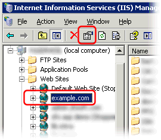
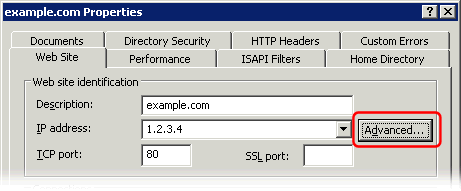

---
category: 16
frontpage: false
comments: true
created-utc: 2019-01-01
modified-utc: 2019-01-01
---
# Configure web-site for access with and without the 'www' domain name prefix

In Simple DNS Plus, setup an A-record for the domain name without the 'www' prefix pointing to the IP address of the web-server, and setup a CNAME-record for the domain name with the 'www' prefix pointing to the domain name without the prefix:

If your web-server if hosting multiple web-sites on the same IP address, you also need to setup both versions of the domain name in the web-site configuration.  
The following illustrates how this is done in IIS (Microsoft's Internet Information Services) and in Apache (see further down).

In the IIS Manager select the web-site and select the properties function:

In the "web site properties dialog" click the the "Advanced" button next to the IP address field:

Add an identity entry for each version of the domain name (with and without the 'www' prefix):

In Apache you need to put one version of the domain name in the "ServerName" setting and the other in the "ServerAlias" setting in the configuration file:

<pre></pre>