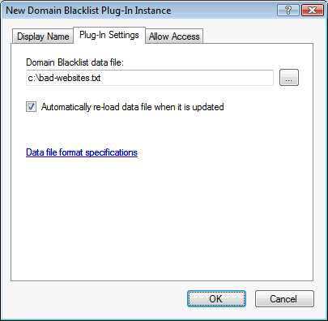
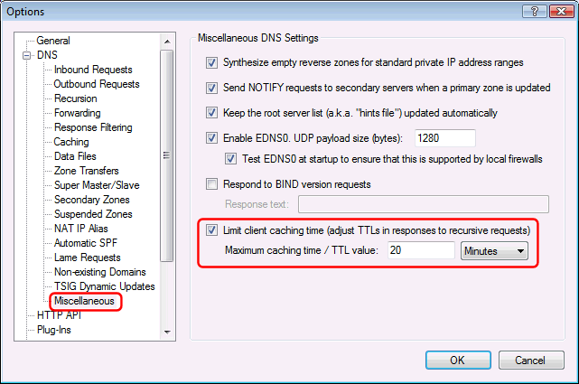

---
category: 8
frontpage: false
comments: true
refs: 110
created-utc: 2019-01-01
modified-utc: 2021-10-28
---
# Domain Blacklist plug-in

This plug-in redirects requests for domain names on a blacklist.

This can be used to block banner ads, malicious web-sites, porn web-sites, etc.  
Doing this at a central DNS server makes it easy to enforce company/family policy for your entire network.  
You can direct browser requests for listed entries either to a dummy IP address, or to an IP address of your own web-server where you serve up some type of "not allowed" message.

Hosts files (and the [hosts file plug-in](https://simpledns.plus/plugin-hostsfile)) are often used for the same thing - but this plug-in is more powerful because it can also match partial host names ("wildcard", "ends-with-domain" and "regular expressions" entries).

This plug-in is also similar to the [DNS Blacklist plug-in](https://simpledns.plus/plugin-blacklist) - except this plug-in is used to block domain names whereas the DNS Blacklist plug-in is used to block IP addresses (typically to block spam and other unwanted e-mails).

In the plug-in instance dialog / Plug-In Settings tab you can specify the data file, and if the file should automatically be reloaded when updated:



If you want to ensure that specific web-sites are not accidentally blocked (for example if you are using a blacklist data file created by someone else) you can setup a whitelist- see [KB1286](https://simpledns.plus/kb/79).

If you want to relax blacklist restrictions at certain times - for example allow social networking web-sites after normal working hours, you can schedule when the plug-in takes effect - see [KB1287](https://simpledns.plus/kb/72).

NOTE: Operating systems and Internet browsers cache DNS records, so if a user recently accessed or was blocked from accessing a web-site, this information might be cached locally on her computer for some time. You may need to restart all browser instances and type "ipconfig /flushdns" at a command prompt on the local computer before it will query the DNS server again for an updated result.  
When using the black/white-list plug-in and users may get different DNS results at different times (as lists are updated), we recommend that you configure Simple DNS Plus to limit client caching to 20 minutes or less. See Options dialog / DNS / Miscellaneous section (v. 5.1 build 118 and later):



**<u>Data file format specifications</u>**

The data file for this plug-in is a simple text file that you can create using notepad or any text editor tool.  
Each line in the file starts with a capital letter I, T, X, M, E or R followed by a space and then some data:

I - the IP address to serve. This is optional and defaults to 127.0.0.1. One entry per file per IP version (4/6).  
T - the host record's TTL in seconds. This is optional and defaults to 300. Only one entry per file.  
X - Date (YYYYMMDD) file expires. This is optional. Lists do not expire by default. Only one entry per file.  
M - exact-match entry. Unlimited entries per file.  
E - ends-with-domain entry. Unlimited entries per file.  
R - regular expression ([about](http://en.wikipedia.org/wiki/regular_expression){target=_blank}) entry. Unlimited entries per file (*).

The domain name of exact-match (M) entries can start with a wildcard character (*.example.com) meaning "all sub-domains". The wildcard character can only be used as the first character and only when immediately followed by a period(.) and a host name. The difference between an ends-with-domain (E) entry and a wildcard exact-match entry (M *...) is that E entries match the domain name itself whereas M entries do not (only sub-domains).

M, E, and R entries can be prefixed with an exclamation character (!) to indicate an exception (do not block).  
Exception entries are always evaluated first and override all other entries.

Empty lines and lines starting with # are ignored.  
The # character indicates the start of a comment. Everything from a # character and the rest of the line is ignored.

Example data file content:

```
#Start of Domain Blacklist data file
I 1.2.3.4 #IP address to serve
T 600 #TTL (time to live) - 10 minutes
X 20120725 #File expires on July 25th 2012
M badhost.domain.com #Exact-match entry
M *.badsubnames.com #Wildcard exact-match entry
E baddomain.com #Ends-with-domain entry
R badterm$ #Regular expression entry
!M goodhost.domain.com #Exact-match entry (exception)
!M *.goodsubnames.com #Wildcard exact-match entry (exception)
!E gooddomain.com #Ends-with-domain entry (exception)
!R goodterm$ #Regular expression entry (exception)
#End of Domain Blacklist data file
```

(*) Note about performance:  
Exact-match (M) and ends-with-domain (E) entries are very fast, even with thousands of entries, because these are stored in hash tables, whereas regular expression (R) entries must be evaluated one by one for each lookup. Regular expressions are pre-compiled and run very efficiently but are still much slower than the other types. For high traffic sites we therefore recommend using M and E entires over R entries whenever possible.

