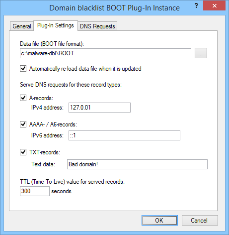

---
category: 8
frontpage: false
comments: true
refs: 110
created-utc: 2019-01-01
modified-utc: 2020-01-07
---
# Domain blacklist BOOT plug-in

This plug-in blocks / redirects DNS requests for domain names listed in a standard DNS "BOOT" file.

Specifically this plug-in was created to handle blocklists from [http://www.malwaredomains.com](http://www.malwaredomains.com/) - but can technically use any list of domain names in the standard BOOT file format.

This plug-in is very similar to the [Domain Blacklist Plug-in](https://simpledns.plus/plugin-domainbl) - except for data file listing the domain names.

It reads the zone names for any primary zones listed in the BOOT file and ignores everything else in the file such as zone file names etc. It will match/block requests for any domain name (including sub-names) matching these zone names.

In the plug-in instance dialog / Plug-In Settings tab you can specify the data file, if the file should automatically be reloaded when updated, which DNS record type to serve for matches (A, AAAA, A6, TXT), and the TTL value for these records:

If you want to ensure that specific web-sites are not accidentally blocked (for example if you are using a blacklist data file created by someone else) you can setup a whitelist- see [KB1286](https://simpledns.plus/kb/79).

If you want to relax blacklist restrictions at certain times - for example allow social networking web-sites after normal working hours, you can schedule when the plug-in takes effect - see [KB1287](https://simpledns.plus/kb/72).

NOTE: Operating systems and Internet browsers cache DNS records, so if a user recently accessed or was blocked from accessing a web-site, this information might be cached locally on her computer for some time. You may need to restart all browser instances and type "ipconfig /flushdns" at a command prompt on the local computer before it will query the DNS server again for an updated result.  
When using the black/white-list plug-in and users may get different DNS results at different times (as lists are updated), we recommend that you configure Simple DNS Plus to limit client caching to 20 minutes or less. See Options dialog / DNS / Miscellaneous section (v. 5.1 build 118 and later):

