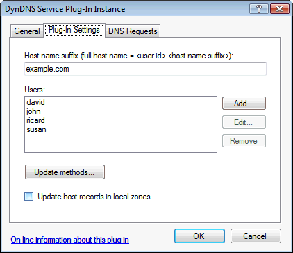
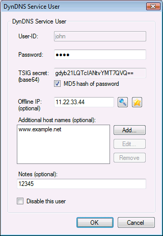
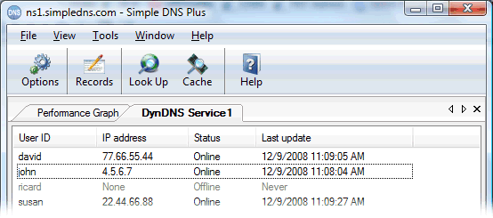

---
title: DynDNS Service plug-in
category: 8
frontpage: false
comments: true
refs: 110
created-utc: 2019-01-01
modified-utc: 2020-01-07
---

This plug-in makes it easy to run your own &quot;DynDNS&quot; service with Simple DNS plus (just like dyndns.com, no-ip.com, tzo.com, etc.). 
Besides from running a public DynDNS service, there are many possible uses for this. For example making it easy to connect with company road warriors, branch offices, etc. 
A DynDNS service makes it possible to connect, using a static host name, to any kind of service including web-server, mail-server, remote desktop, VPN, etc. running on a computer with a dynamic Internet IP address.

Each user / client computer automatically gets a host name in the format &quot;&lt;user-id&gt;.&lt;host name suffix&gt;&quot; which can be used to access that computer over the Internet. Additional host name aliases (any domain name) can also be specified for each user.

In order to use this plug-in, Simple DNS Plus must be running on a static public IP address, and you must have a registered Internet domain name correctly configured and hosted by this Simple DNS Plus server. 
You can use any registered domain name that you own (or a sub-name of such names) as the DynDNS host name suffix. Client computers must run a DynDNS client (typically a small program running in the system tray) - see update methods below for details.

In the plug-in instance dialog / Plug-In Settings tab you can specify the users and other settings (explained below) for the DynDNS service:

 

<ul>
	<li><strong>Host name suffix </strong> 
	All DynDNS clients automatically get a host name under this name.</li>
	<li><strong>Users</strong> 
	List of users. Click Add/Edit/Remove buttons the edit. 
	See &quot;DynDNS Service User&quot; dialog below for details.</li>
	<li><strong>Update methods</strong> 
	Click to enable different client update methods. 
	See &quot;DynDNS client update methods&quot; dialog below for details.</li>
	<li><strong>Update host records in local zones</strong> 
	When enabled, each time the plug-in receives a user update (new IP address), it will update the associated host records (A-records) in local zones. 
	This requires that a local primary zone with the same name as the host name suffix (or a parent name) exists, and that zones exist for any additional host names specified for each user. 
	NOTE: It is only necessary to use this option if you have one or more secondary DNS servers that needs to be updated with these host names.</li>
</ul>

In the &quot;DynDNS Service User&quot; dialog, you can specify the settings for each user (details below):

<ul>
	<li><strong>User-ID</strong> 
	Specify a unique user-ID. Characters allowed are a-z, 0-9, and hyphen (-) only.</li>
	<li><strong>Password</strong> 
	Any characters / length is allowed, but note that non-english characters may not work with some DynDNS client programs / update methods.</li>
	<li><strong>TSIG secret</strong> 
	Used for client updates via DNS TSIG signed dynamic updates (see &quot;DynDNS client update methods&quot; below). 
	Specify a base64 encoded TSIG secret. 
	When &quot;MD5 hash of password&quot; is checked, the value will be generated automatically.</li>
	<li><strong>Offline IP</strong> 
	Some DynDNS client programs have the ability to signal that the client is going offline. 
	This option can be used to point the host name(s) for the client to a specific IP address (for example for a web-server with a &quot;client offline&quot; message) when this happens.</li>
	<li><strong>Additional host names</strong> 
	Any additional host names that should point to the user's IP address.</li>
	<li><strong>Notes</strong> 
	This field can be used to store simple notes/remarks about the user. 
	It can also be used to control access to other plug-ins for DynDNS users. For example, you can setup a rule on a Domain Blacklist plug-in (in its properties dialog / DNS Requests tab) that it should only process DNS requests from DynDNS users with the text 'BL' in their notes.</li>
	<li><strong>Disable this user</strong> 
	When checked, the user will not be allowed to update, and the plug-in will not serve DNS records for the user (note that DNS records may still be served from local zones).</li>
</ul>

In the &quot;DynDNS client update methods&quot; dialog, you can enable different client update methods:

<ul>
	<li><strong>DNS - TSIG signed dynamic updates </strong> 
	Secure updates received directly through the DNS protocol (RFC2136 / 2845) on the IP address and port that Simple DNS plus listens on (see Options dialog / DNS / Inbound Requests section). 
	Unfortunately this method is only supported by few client programs (examples <a href="http://noeld.com/dynsite.asp" target="_blank">DynSite</a> and <a href="http://www.directupdate.net/" target="_blank">DirectUpdate</a>). 
	Also note that server and client clocks must be synchronized to within a few minutes. This is usually not a problem since recent operating systems automatically synchronize clocks with an Internet time server.</li>
	<li><strong>GnuDIP direct TCP protocol </strong> 
	Secure updates through a TCP connection (usually to port 3495) using the <a href="http://gnudip2.sourceforge.net/gnudip-www/latest/gnudip/html/protocol.html" target="_blank">GnuDIP direct TCP protocol</a>. 
	For a list of client programs that support this update method <a href="http://gnudip2.sourceforge.net/gnudip-www/latest/gnudip/html/clients.html" target="_blank">click here</a>.</li>

	<li><strong>HTTP - URL authentication</strong> 
	This is the simplest update method. It can be used directly in a browser and is supported by most client programs. 
	However - this method is not very secure because the user's password is transmitted in clear text as part of the URL. 
	WARNING: Because the password is part of the URL, this may automatically be logged on proxy servers, firewalls, etc. 
	The HTTP response will contain an &quot;X-DynDNS-Result&quot; header with the value &quot;OK&quot; or &quot;FAIL&quot;, and a meta tag with a &quot;name&quot; attribute value of  &quot;DynDNS-Result&quot; and &quot;content&quot; attribute with the value &quot;OK&quot; or &quot;FAIL&quot;. 
	For more details on HTTP update methods, see &quot;Base URL for HTTP services&quot; below.</li>

	<li><strong>HTTP - Basic HTTP authentication</strong> 
	This update method can also be used directly in a browser and is also supported by many client programs. 
	It is more secure than the &quot;URL authentication&quot; method because the password is Base64 encoded and is not part of the URL. However the password is still easily accessible for anyone &quot;listening&quot; on the line. 
	The HTTP response will contain an &quot;X-DynDNS-Result&quot; header with the value &quot;OK&quot; or &quot;FAIL&quot;, and a meta tag with a &quot;name&quot; attribute value of  &quot;DynDNS-Result&quot; and &quot;content&quot; attribute with the value &quot;OK&quot; or &quot;FAIL&quot;. 
	For more details on HTTP update methods, see &quot;Base URL for HTTP services&quot; below.</li>

	<li><strong>HTTP - GnuDIP authentication</strong> 
	Secure update method over HTTP. 
	For a list of client programs that support this method <a href="http://gnudip2.sourceforge.net/gnudip-www/latest/gnudip/html/clients.html" target="_blank">click here</a>. 
	For more details on HTTP update methods, see &quot;Base URL for HTTP services&quot; below.</li>

<li><strong>HTTP - Dyn.com URL format (Basic HTTP auth.)</strong> 
See <a href="https://simpledns.plus/kb/66" target="_blank">https://simpledns.plus/kb/66</a> for details.
</li>

	<li><strong>Enable remote IP detection service</strong> 
	Provides a simple service that returns the IP address of the sender of the HTTP request. 
	This can be used directly in a browser and by some DynDNS client programs.</li>
	<li><strong>Base URL for HTTP services</strong> 
	Specify the URL that the plug-in should listen for HTTP requests on. 
	The host name part of the URL must have a DNS record (elsewhere) pointing to the public IP address of this computer. If behind a NAT router, port 80 (or the port specified in the URL) must be mapped to the private IP address of the computer running Simple DNS Plus. 
	NOTE: This plug-in uses the Windows <a href="http://msdn.microsoft.com/en-us/library/aa364510%28vs.85%29.aspx" target="_blank">HTTP Server API</a> allowing it to share port 80 and host names with any other applications using the API - including IIS. 
	This means that you can run a web-site for &quot;www.example.com&quot; in IIS on the same computer and still use &quot;http://www.example.com/dyndns/&quot; as the URL for this plug-in.</li>
	<li><strong>Show full URLs</strong> 
	Click this button the show the following dialog - listing the full URLs of the enabled HTTP update methods:</li>
</ul>

The DynDNS Service plug-in also has a &quot;view&quot; in the main Simple DNS Plus window (open from View menu), where you can see current status of DynDNS users:

The list can be sorted by clicking the column headers. 
To manually set a user to offline status, right click on the user and select &quot;Set to offline&quot; from the pop-up menu.

Other IMPORTANT notes about this plug-in:

<ul>
	<li>The HTTP based update methods of the plug-in require Windows XP SP2 / Windows Server 2003 or later.</li>
	<li>DynDNS client programs that specify a host name to update must use &quot;&lt;user-id&gt;.&lt;host name suffix&gt;&quot;. 
	Additional host names specified for a user cannot be used for this.</li>
	<li>If the plug-in receives a HTTP based update request which does not specify a client IP address, the plug-in will use the IP address that the HTTP request came from. 
	However, if the HTTP request header contains an &quot;X-Forwarded-For&quot; or &quot;Client-IP&quot; header (indicating that the request passed through a proxy server), it will use the IP address listed in that header instead (private IP addresses excepted).</li>
	<li>If a DynDNS client user wants to run a web-server but is blocked from using port 80 by his ISP, you might consider using the <a href="https://simpledns.plus/plugin-httpredir">HTTP Redirector plug-in</a> to redirect HTTP requests for the user's domain name to a diferent port (where he runs a web-server) - optionally &quot;cloaking&quot; the alternate port. 
	This is a very common combination (DynDNS and HTTP redirection / cloaking).</li>
	<li>One of the more popular DynDNS client programs for Windows is &quot;DynSite&quot; by No&euml;l Danjou. 
	To make it easy to configure DynSite to work with your DynDNS service based on this plug-in, we have created an on-line function to generate plug-in configuration files for DynSite - <a href="https://simpledns.plus/dynsite-plugin">available here</a>.</li>
	<li>If you want to integrate this plug-in with your systems, for example allowing user sign-up at your web-site, you can use the <a href="https://simpledns.plus/kb/115">HTTP API</a> &quot;getpluginconfig&quot; and &quot;updatepluginconfig&quot; commands. 
	You can also retrieve the current status of DynDNS users through the &quot;pluginstate&quot; command.</li>
</ul>

For details on binding https:// to an SSL certificate - see <a href="https://simpledns.plus/kb/163">https://simpledns.plus/kb/163</a> (article talks about HTTP API, but it works the same for the DynDNS plug-in).

