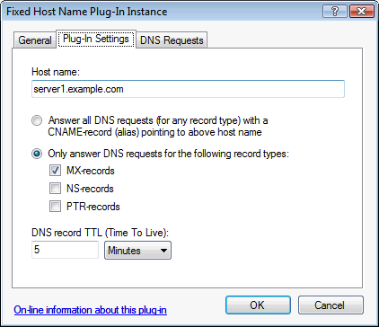

# Fixed Host Name plug-in

This plug-in serves a fixed host name - either to all DNS requests as a CNAME (alias), or to DNS requests for MX, NS, and/or PTR-records.

On the "Plug-In Settings" tab, specify the host name to respond with, the record type(s), and the DNS record TTL value:

WARNING: By default, this plug-in responds to all DNS requests. If you only want it to respond for specific names or want to specify exceptions, you can limit which DNS requests are processed using the settings in the "DNS Requests" tab.

