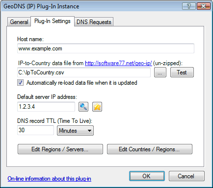
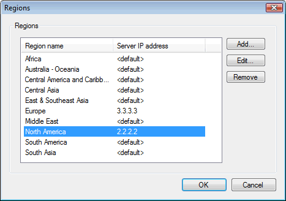
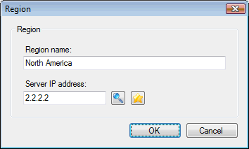
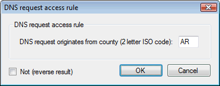

# GeoDNS plug-in

This plug-in provides a different DNS response depending on what country the DNS request originates from.  
This can be used to direct Internet traffic (web, FTP, streaming media, etc.) to a server geographically closer to the end-user, or with contents specific for a geographical area.  
Note that this is based on the IP address of the resolving DNS server sending the DNS request, which could be in a different country than end-user. However most end-users will typically be using a DNS server in their own country.

To determine the sender's country, the plug-in is designed to use the free and daily updated IP-to-Country database from [http://software77.net/geo-ip/](http://software77.net/geo-ip/){target=_blank}  
Countries are grouped into "regions" for each of which a unique server IP address/alias can be defined.  
The plug-in is pre-configured with a default set of 10 regions (North America, Middle East, etc.) based on [CIA's World Factbook](https://www.cia.gov/the-world-factbook/){target=_blank}, but you can configure this in any way that you prefer.

There are two variants of this plug-in - "IP" and "CNAME" - both included in the same .dll file.  
The "IP" variant responds with a single server IP address (A-record). We recommend using this when you only have a single server (or multiple servers in a cluster behind a single IP address) serving each region.  
The "CNAME" variant responds with a server name alias (CNAME-record). The host name pointed to by this CNAME-record may represent multiple IP addresses (multiple A-records) defined elsewhere - for example a local or remote DNS zone or by another plug-in. This can be used when you have multiple servers on multiple IP addresses for each region -typically using round robin load distribution.  
Note that the "CNAME" plug-in variant requires an "unlimited zones" license for Simple DNS Plus.

On the "Plug-In Settings" tab, enter the following settings (explained below the image):

- **Host name**  
Enter the host name that you want to provide GeoDNS data for. For example "www.example.com".  
IMPORTANT: For the "CNAME" plug-in variant, always use a sub-name (like a "www." prefixed name) for which no other DNS records exist. Never use a zone name (such as "example.com") because the CNAME-record would conflict with the zone's SOA- and NS-records and cause various problems.  
If you want to allow end-users to enter your web-site address without the www prefix, you should point (using an A-record in the zone) the name without the prefix to a default web-server which redirects (via HTTP header) to the www version of the name - this is exactly what Google.com does.
- **IP-to-Country data file**  
Specify the data file to use.  
Click the "..." button to browse the local file system and find the file.  
Click the "Test" button to get a count of IP address ranges and countries in the file, and to look up IP addresses in it.
- **Automatically re-load data file when it is updated**  
When checked, the plug-in will monitor the data file for updates.
- **Default server IP address / alias**  
The server IP address / alias to serve if the country/region is not found or does not have a specific server IP address / alias defined.
- **DNS record TTL (Time To Live)**  
How long the DNS record served may be cached by other DNS servers / caches.
- **Edit Regions / Servers...**  
Click this button to open the Regions dialog where you can configure regions and map these to server IP addresses/aliases:

- **Edit Countries / Regions...**  
Click this button to open the Countries dialog where you can configure countries and map these to regions:

The GeoDNS plug-in can also be used as a source when setting up DNS request rules for other plug-ins:

For an example of using this for blocking DNS requests from specific countries, see [Blocking DNS requests from specific countries](/kb/6).

