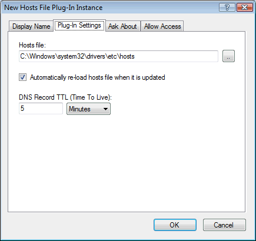

# Hosts File plug-in

This plug-in serves host (A/AAAA) and reverse (PTR) DNS records from a standard [hosts file](https://simpledns.plus/helplink?p=df_hostsfile).

This can be used as a very simple way to store and host DNS records, but more commoly this is used to block ads and malicious web-sites.  
You can create your own hosts file, but there are also some very kind people on the Internet who maintain hosts files for various purposes and make these publicly available. For example [http://hosts-file.net](http://hosts-file.net){target=_blank} and [http://pgl.yoyo.org/adservers](http://pgl.yoyo.org/adservers){target=_blank}  
For more advanced web-site blocking, see also the [Domain Blacklist plug-in](https://simpledns.plus/plugin-domainbl).

On the "Plug-In Settings" tab, enter the location of the hosts file, specify if the file should be re-loaded automatically when updated, and enter the TTL to be used:

You can use multiple hosts files by setting up multiple "Hosts File" plug-in instances.

Host file line example:

<pre></pre>
Defines an A-Record (example.com -&gt; 1.2.3.4) and a PTR-record (4.3.2.1.in-addr.arpa -&gt; example.com).

