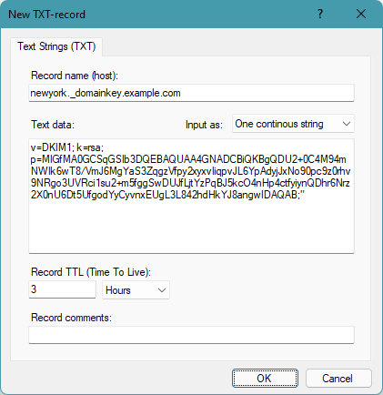

# Configuring DKIM records

DKIM (DomainKeys Identified Mail) records are used to fight e-mail spam and phishing scams (typically in combination with [DMARC](/kb/207) and [SPF](/kb/18) records).

DKIM works by signing outbound e-mail messages with a cryptographic signature which can be verified by the recipient to ensure that the messages originate from an authorized system.  
The process of signing messages and verifying signatures is done by the e-mail servers at each end - not by end-users client software.

DKIM uses DNS TXT-records to publish public keys for a domain name for such signatures.

An e-mail message signed with DKIM will include a header item "DKIM-Signature" containing the cryptographic signature and a few other fields including a "selector" (s=) - for example:

```
DKIM-Signature: 
  v=1;
  a=rsa-sha256;
  c=relaxed/relaxed;
  d=example.com;
  h=from:subject:mime-version:reply-to:to:content-type:content-transfer-encoding;
  s=newyork;
  bh=ENq9Fcw0HVGhBsC7hjGiOZSRndvo1FjCRDG3BS4niEw=;
  b=ThaIBND1ZfHMJJzX7wF0sD5rSOqYFTgDBx8llW1MJ2Riu...
```

For the receiving e-mail server to verify this signature, it must first obtain the public key for the selector value.  
For above example (with the selector "newyork"), this is stored in a DNS TXT-record with the name "newyork._domainkey.example.com".  
In other words, the name of this TXT-record is the selector (s=...) + ._domainkey. + the domain name.  
The data of this TXT-record is in the format "v=DKIM1; k=rsa; p=..." where value after p= is the public key.  
Additional fields may also be included.

The DKIM record selector and value is typically produced by the e-mail server software / service provider, and is typically provided in the standard DNS zone file format like this:

```
newyork._domainkey  TXT  10800  "v=DKIM1; k=rsa; p=MIGfMA0GCSqGSIb3DQEBAQUAA4GNADCBiQKBgQDU2+0C4M94mNWIk..."
```

In Simple DNS Plus such a record would look like this:



The selector value ("newyork" in above example) may be a fixed value used by your e-mail server software, or you may be able to configure multiple selectors for example for different branch offices or individual e-mail servers.  
The important thing is that for each selector used to sign outgoing messages from your domain name, you setup a separate TXT-record in DNS.

Note that if you use an e-mail service (as opposed to running your own e-mail server) such as GMail, Exchange Online, etc., they may provide you with a CNAME-record instead of the TXT-record mentioned above. This creates an alias / redirection for the DKIM record, so that the service provider can update the DKIM key on their own DNS server as needed.


DKIM is defined in [RFC6376](https://www.rfc-editor.org/rfc/rfc6376.txt)
