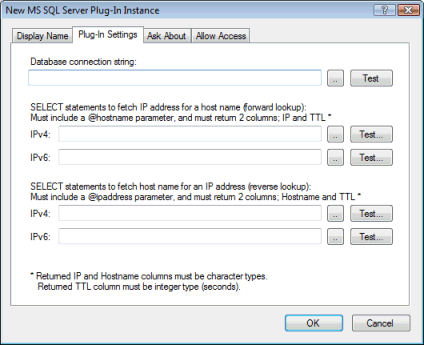

# MS SQL Server plug-in

This plug-in queries a Microsoft SQL Server for host records and optionally reverse records.

SQL queries are executed asynchronously (in a separate thread) and therefore won't slow down other requests not using the plug-in.

In the plug-in instance dialog / Plug-In Settings tab you can specify the database connection string and SQL SELECT statements to be used to fetch records:

Helper dialogs are available to build the connection string and SELECT statements:

At least one of the SELECT statement fields must be filled out, but you can leave some blank if you don't want to use that feature.

There are no specific requirements for database table layout. You just need to be able to execute an SQL query which returns the required data. The query can be based on a table, view, stored procedure, or any other valid SQL expression.

For forward lookups (name to IP) you need to include a @hostname parameter in the SELECT statement, and the query must return two columns; IP-address and TTL as the first and second columns.

For reverse lookups (IP to name) you need to include a @ipaddress parameter in the SELECT statement, and the query must return two columns; host-name and TTL as the first and second columns.

For either type of lookups (forward/reverse), you may optionally include a @clientip parameter which will contain the IP address of the client requesting the data.

The column names of the returned data do not matter - only the column order.

If there are more than one row or more than two columns returned, additional rows and columns are ignored.

NOTE: Serving data from directly from a SQL server with this plug-in can be very powerful, but keep in mind that querying a SQL server will never be as fast as serving DNS records directly from RAM, as Simple DNS Plus does when serving data from local zones. Therefore we recommend that you limit plug-in queries to only those specific domains that you have stored in SQL.

