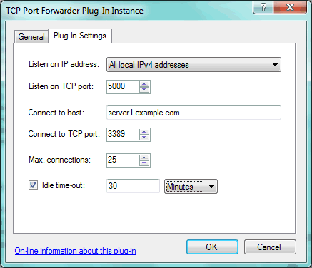
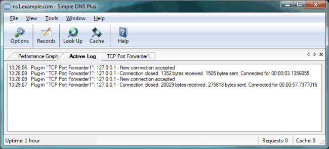

---
category: 8
frontpage: false
comments: true
refs: 110
created-utc: 2019-01-01
modified-utc: 2020-01-08
---
# TCP Port Forwarder plug-in

This plug-in provides simple TCP port forwarding.

If the Simple DNS Plus computer is connected to both the Internet and to a private network (LAN), this can be used to forward connections from the Internet to a computer on the LAN. For example mapping remote desktop connections (port 3389).

On the "Plug-In Settings" tab, enter the following settings (explained below the image):

- **Listen on IP address**  
The local IP address that the plug-in should listen for incoming connections on.
- **Listen on TCP port**  
The local TCP port number that the plug-in should listen for incoming connections on.
- **Connect to host**  
The server host name or IP address that connections should be forwarded to.
- **Connect to TCP port**  
The server TCP port that connections should be forwarded to.
- **Max. connections**  
The maximum number of connections that can be forwarded at the same time.
- **Idle time-out**  
If enabled, the connection will be closed if no data has been sent in either direction for this legth of time.

TheTCP Port Forwarder plug-in also has a "view" in the main Simple DNS Plus window (open from View menu), where you can see current and total number of connections, and the total bytes transferred:

The Simple DNS Plus log (Active Log View and log files) will show when individual connections are accepted and closed:

Note that this plug-in does not provide any DNS records or any other functionality related to directly to DNS. But you can of course point domain names to the IP address that the plug-in listens for connections on, using A-records provided through local zones or other plug-ins.

