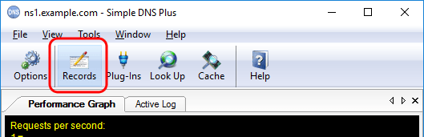
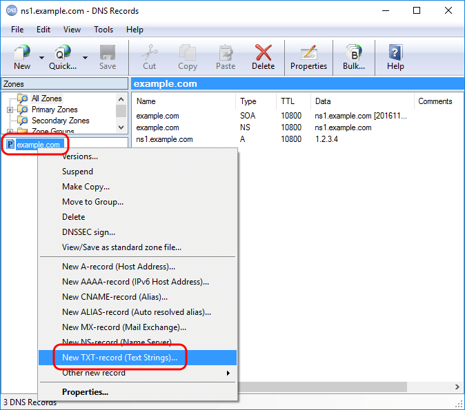
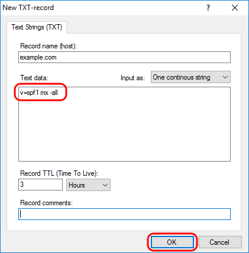

---
category: 12
frontpage: false
comments: true
created-utc: 2019-01-01
modified-utc: 2022-04-12
---
# Configuring SPF records

SPF (Sender Policy Framework) records are used to fight e-mail spam and phishing scams (typically in combination with [DMARC](/kb/207) and [DKIM](/kb/17) records).

SPF uses DNS TXT-records to define which hosts are permitted to send e-mails for a domain.

This works by defining an SPF-record (a DNS TXT-record) for the e-mail domain name specifying which hosts (e-mail servers) are permitted to send e-mail from the domain name.  
Other e-mail servers can lookup this record when receiving an e-mail from this domain name to verify that sending e-mail server is connecting from a permitted IP address.

Simple DNS Plus comes with a plug-in which can automatically synthesize SPF-records for all domain names hosted
on your server which do not already have SPF-records - see the [Auto SPF plug-in](/kb/204).

You can also setup SPF-records for individual domain names.  
For example to create an SPF-record specifying that only those e-mail servers handling inbound e-mail for "example.com" (as specified in MX-records) are allowed to send e-mails from "...@example.com" (fits most setups), you would follow these steps:

First click the "Records" button in the main window:

 

Then in the DNS Records window, right-click on the zone in the left list, and select "New TXT-record (Text Strings)" from the pop-up menu:

Enter the SPF text string (without surrounding quotes), and click the "OK" button:

You can get the exact text string to enter by using the setup wizard at <http://www.open-spf.org>

### SPF and the HELO/EHLO host name

In addition to checking the domain name part of the sender's e-mail address, some e-mail servers also perform SPF checks on the SMTP session HELO/EHLO greeting host name.

Therefore always make sure that your e-mail server is configured to use a correct host name (like "mail.example.com") in the HELO/EHLO greeting, and that an A- and/or AAAA-record exists for this host name in DNS.

When using the Auto SPF plug-in, make sure that the automatic SPF-record data is also valid for the HELO/EHLO host name, or define a specific SPF-record for the HELO/EHLO name in the zone where this belongs (this will override the automatic SPF record).

Note that the default Auto SPF plug-in record data "v=spf1 mx -all" will fail such a test if no MX-record exists for your HELO/EHLO name.  
For example, if your domain name is "example.com" and your mail server is named "mail.example.com" (and uses this in HELO/EHLO greetings), you would probably only have an MX-record for "example.com" - not for "mail.example.com", and therefore "v=spf1 mx -all" fails to validate "mail.example.com". 
Instead you could use "v=spf1 ip4:1.2.3.4 -all" (where 1.2.3.4 is the IP address of your mail server), which would work for both types of tests.

### The DNS SPF-record type (numeric 99):

In 2006 a new DNS record type "SPF" (numeric ID 99) was introduced through RFC4408. This record type (and RFC) was made obsolete in 2014 through RFC7372.  
Since the introduction of the SPF concept, it has always been valid and correct to publish SPF data using DNS TXT-records. Between 2006 and 2014 both record types (TXT / SPF) were valid and correct. However now only TXT-records should be used.  
All e-mail servers that we know of support SPF through DNS TXT-records.  
Therefore the DNS "SPF" record type (99) was removed from Simple DNS Plus in v. 5.3.

### Meaning of "SPF"

The abbreviation "SPF" used to mean "Sender Permitted From" but was later changed to "Sender Policy Framework".

### Microsoft's "Sender ID"

Microsoft used to use the name "Sender ID" about SPF - this was the exact same thing.  
The name confusion is the result of a "merge" between Microsoft's "Caller-ID" and SPF in May 2004 - where essentially only SPF survived.

For more information about SPF, see <http://www.open-spf.org>