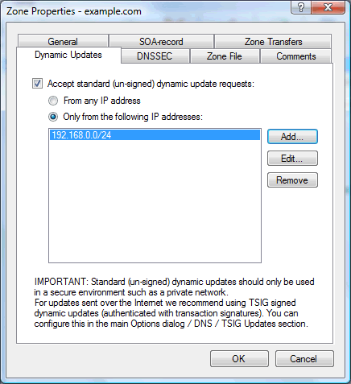

---
category: 14
frontpage: false
comments: true
created-utc: 2019-01-01
modified-utc: 2019-01-01
---
# "The system failed to register host (A) resource records (RRs) for network adapter..." warning in Windows event log

This warning is recorded because Windows is configured to "register" its IP addresses in DNS - and the DNS server responsible for the computer's host name does not accept dynamic updates for that name from the computer's IP current address.

This "registration" is enabled by default and can be enabled/disabled on the "DNS" tab of the "Advanced TCP/IP Settings" dialog:  
(from the Windows Control Panel open the "Network and Sharing Center", click "Manage network connections", right-click on your network connection and from the pop-up menu select "Properties", select "Internet Protocol Version 4 (TCP/IPv4)" and click the "Properties" button, on the "General" tab click the "Advanced button")

To configure Simple DNS Plus to accept the "registration", you must enable standard dynamic updates for the zone that the client computer's host name belongs to.  
This is enabled in the Zone Properties dialog / Dynamic Updates tab:  
(from the main window in Simple DNS Plus click the "Records" button, then right-click a zone in the left list and from the pop-up menu select "Properties")

> [!Important] Make sure to only allow standard dynamic updates from trusted IP addresses.