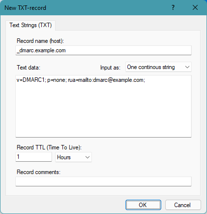

# Configuring DMARC records

DMARC (Domain-based Message Authentication, Reporting & Conformance) records are used to fight e-mail spam and phishing scams (in combination with [SPF](/kb/18) and [DKIM](/kb/17) records).

DMARC uses DNS TXT-records to communicate how receiving e-mail servers should treat e-mail messages that do not pass [SPF](/kb/18) or [DKIM](/kb/17) checks - and optionally how to report back to domain owners.

For example if an e-mail's sender/from-address is "name@example.com", the receiving e-mail server will perform DMARC processing by first retrieving the DNS TXT-record "_dmarc.example.com". In other words, the name of this TXT-record is "_dmarc." + the e-mail domain name.  
The data of this TXT-record always starts with "v=DMARC1; ...", and may contain several field describing what action to take, domain alignment, reporting, etc.

Required fields are "v" (value always "DMARC1") and "p". The value for "p" (policy) can be either "none", "quarantine",  or "reject" - ie. what the receiving e-mail server should do if a message does not pass SPF or DKIM tests.

A commonly used optional field is "rua" which specifies the e-mail address that aggregate reports should be sent to (in the format "mailto:name@example.com").

For additional fields, see section 6.3 of [RFC7489](https://www.rfc-editor.org/rfc/rfc7489.txt)

You can use our on-line [DMARC record wizard](/dmarc-wizard) to generate your DMARC record data.

In Simple DNS Plus, a DMARC record might look like this:

For more information about DMARC, see [RFC7489](https://www.rfc-editor.org/rfc/rfc7489.txt) and <https://dmarc.org>.

