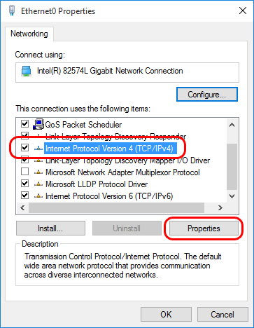
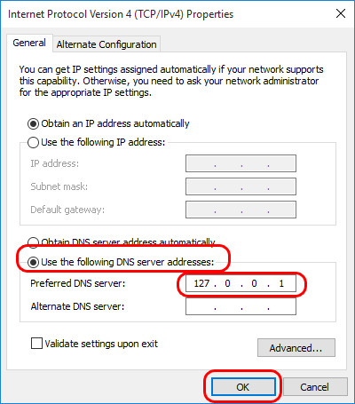

# Configuring Windows to use local DNS server (Windows 8.1 / Windows 10 / Windows Server 2012R2)

Right-click the Windows Start button (lower left corner of Windows desktop), and select "Network Connections":  
  
  
  
Then in the "Network Connections" window, right-click your primary network connection, and select "Properties":  
  
  
  
Select the "Internet Protocol Version 4 (TCP/IPv4)" item, and click the "Properties" button:  
  
  
  
Select "Use the following DNS servers addresses", and enter the IP address of the local DNS server (*) as the Preferred DNS server:  
  
  
  
Finally click the "OK" button in this and the previous dialog to save your changes.  
  

(*) The DNS server IP address must match an IP address that Simple DNS Plus is configured to listen on in the Options dialog / DNS / Inbound Requests section.  
If you are configuring the computer which Simple DNS Plus is running on, you can use 127.0.0.1 (the "localhost" address) - otherwise you must use an IP address which is accessible over the local area network.

