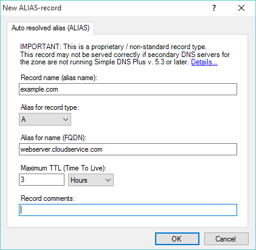

---
category: 5
frontpage: false
comments: true
created-utc: 2019-01-01
modified-utc: 2019-01-01
---
# ALIAS-records (Auto Resolved Alias)

ALIAS-records (in Simple DNS Plus v. 5.3 and later) are virtual alias records resolved by Simple DNS Plus at at the time of each request - providing "flattened" (no CNAME-record chain) synthesized records with data from a hidden source name.

This can be used for different purposes - including solving the classic problem with CNAME-records at the domain apex (for the zone name / for "the naked domain").

Say you want to host a website at a domain name without the "www" (or other) prefix. The IP address for the web-server is not static (subject to change) - only a static host name is provided for the web-server.  
This is a common scenario with many cloud services today including Azure VMs, GitHub pages, Heroku, etc.   
The solution that often springs to mind, is to configure a CNAME-record for your domain name pointing to the static host name provided by the cloud service.  
Unfortunately this is not possible because such a CNAME-record would conflict with other records that are always present for the zone name (SOA / NS).

Now you can do this by using an ALIAS-record instead.

ALIAS-records are similar to CNAME-records. The difference is that ALIAS-records are resolved and synthesized into the requested record type (such as A-records) by the authoritative DNS server (Simple DNS Plus) instead of by the client / resolving DNS server, and an ALIAS-record is tied to a specific record type (such as A-records) and therefore does not conflict with other records with the same name but of a type other than what the ALIAS-record is tied to.

### Other features / benefits:

*   **CNAME chain flattening**  
    When using large cloud service providers, DNS host names often point to a chain of CNAME records. Each client (or their DNS resolver) has to resolve each one of these CNAMEs - delaying access to your service.  
    By using an ALIAS-record, you basically move this work to your own DNS server and provide clients with "flattened" records (all interim CNAME-records are removed / hidden), and thereby provide faster access for your clients.  
    Simple DNS Plus will of course also have to resolve each CNAME-record the first time it serves the ALIAS-record, but after that responses can be provided from the cache with no delay.  

*   **Multiple ALIAS-records for same name / same type**  
    You can have multiple ALIAS-records for the same name and record type - resolving records from multiple names and combining the results into one synthesized record set.  
    And yes, this works very well with the **round robin** option for load balancing.  

*   **Multiple ALIAS-records for same name / different types**  
    You can have multiple ALIAS-records for the same name but different record types.  
    For example: yourname.com / A-records -> "webserv1.cloudoperator.com", and yourname.com / MX-records -> "smtp.othercompany.com".   

*   **Wildcard records**  
    ALIAS-records can also be wildcard records (*.example.com). Easy way to provide records for many sub-names.  

*   **TTL**  
    The TTL (Time To Live) value for an ALIAS-record is a maximum value. A synthesized record provided to the client will have a TTL value reflecting the lowest TTL value of all the records that were used (including any interim CNAME records).  
    This ensures that clients will not cache stale data.

### Please consider / gotchas:

*   **Proprietary / non-standard**  
    The ALIAS-record type is a proprietary / non-standard record type - not understood by other DNS server / resolver implementations.  
    Generally, this is not a problem because ALIAS-records are synthesized into other (standard) record types before they leave Simple DNS Plus.  
    This only becomes an issue if the raw zone data is shared with other DNS server implementations - for example through zone transfers (see "Secondary DNS servers" below).  

*   **Secondary DNS servers**  
    ALIAS-records may not be served correctly if secondary DNS servers for the containing zone are not running Simple DNS Plus v. 5.3 or later.  
    If you don't run your own secondary DNS servers - consider using [ns2service.net](https://ns2service.net) - which is based on Simple DNS Plus and fully supports these ALIAS-records.  

*   **CDNs**  
    Global CDNs (Content Delivery Networks) typically use the IP address of the DNS resolver to determine the delivery node closest to the client. If you point an ALIAS-record to the host name of such a CDN (not recommended), Simple DNS Plus in effect becomes the resolver and so all your clients will be served by the node closest to Simple DNS Plus - which is not necessarily closest to each client.  

*   **DNSSEC**  
    ALIAS-records are not compatible with DNSSEC. Signing a zone containing ALIAS-records will not work correctly.  

### ​Other implementations:

Similar implementations of virtual alias records ("ANAME", "ALIAS", "CNAME flattening") are offered by various DNS service providers. These are generally not compatible with each other nor with the implementation in Simple DNS Plus. There is no standard (RFC or similar) for this.