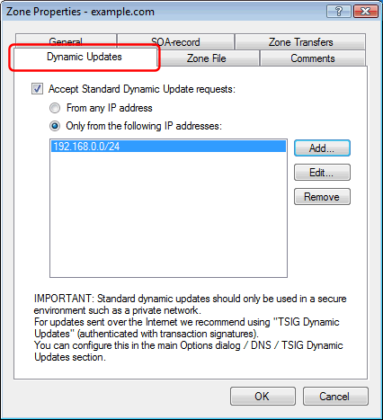

---
category: 5
frontpage: false
comments: true
created-utc: 2019-01-01
modified-utc: 2019-01-01
---
# Does Simple DNS Plus support Active Directory?

NOTE: Windows Server 2008 R2 has a bug which causes a "Bad DNS Packet" error when trying to setup Active Directory with Simple DNS Plus - for details and fix [click here](https://simpledns.plus/news/10).

Yes, Simple DNS Plus supports both the "SRV" record type (required for AD) and "dynamic updates" (makes configuration with AD much easier).

The Windows Server will attempt to create the necessary DNS records through DNS dynamic updates - so by enabling this for the zone in which your network belongs, everything should be automatic.

To enable dynamic updates, in the Simple DNS Plus main window, click the "Records" button:

Right-click a zone and select "Properties" from the pop-up menu:

Select the "Dynamic Updates" tab, check "Accept Standard Dynamic Update requests", and make sure the Windows server IP address is included:

Or you can add the required DNS records manually - but this can difficult, and we highly recommend the automatic setup through dynamic updates.

For more details on the DNS records etc., please see the Microsoft document ["Configuring Non-Windows 2000 DNS Servers to Support Active Directory"](https://simpledns.plus/mskb/msad.pdf).

Note: Simple DNS Plus does not store its own data in Active Directory.

