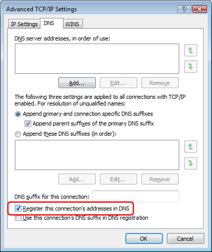
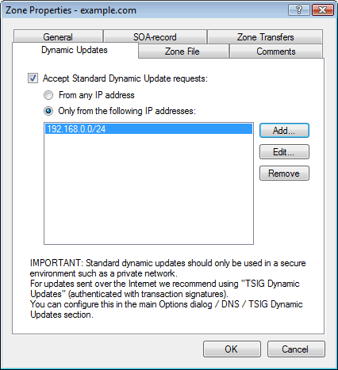

---
category: 4
frontpage: false
comments: true
refs: 126,40,127,125,80,173
created-utc: 2019-01-01
modified-utc: 2019-01-01
---
# Does Simple DNS Plus support dynamic DNS updates?

There are generally two different meanings for the term "dynamic DNS" (and yes, Simple DNS Plus supports both):

**1)** A service used by people with dynamic IP addresses (for example with dial-up Internet connections) to assign a domain name to their ever changing IP address.  
Typically a small software client application must be installed on the client computer.  
For an example of this, please see [http://www.dyndns.com/](http://www.dyndns.com/){target=_blank}

Generally these dynamic DNS client applications will update the remote DNS server either via HTTP requests (accessing a script on the dynamic DNS service web server, which in turn updates the DNS server), or via cryptograhically signed update messages over the DNS protocol itself (TSIG).

If you have a static IP address yourself, you can use Simple DNS Plus to run such a service for other people with dynamic IP addresses.  
Simple DNS Plus supports both methods - please see the [references](#kbref) section below.

**2)** Recent versions of Microsoft Windows (Me/2000 and later) have a feature which allows the client computer to "register" itself with a local DNS server. This is done through dynamic DNS updates sent via the DNS protocol directly.

In Windows you can enable this feature in the properties for a network card under TCP/IP / Advanced... / DNS:

And in Simple DNS Plus you can specify which computers (IP addresses) are allowed to send these dynamic updates for each zone in the Zone Properties dialog / Dynamic Updates tab:

