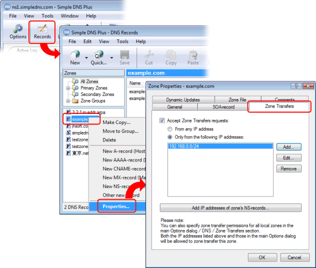

# Enabling Zone Transfers from another DNS server

You can enable zone transfers for all local zones in the Options dialog, or you can enable zone transfers for a single zone in the Zone Properties dialog.

To enable zone transfers for all zones, from the main window, click the "Options" button. Then in the Options dialog, select DNS / Zone Transfers, and specify which IP addresses are allowed to zone transfer:

To enable zone transfers for a single zone, in the main window click the "Records" button. In the DNS Records window, right-click on the zone that you wish the enabled zone transfers for and select "Properties" from the popup menu. In the "Zone Properties" dialog, select the "Zone Transfers" tab, and specify which IP addresses are allowed to zone transfer:

