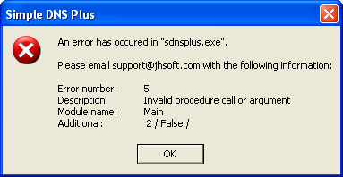

---
category: 14
frontpage: false
comments: true
created-utc: 2019-01-01
modified-utc: 2019-01-01
---
# Error 5 "Invalid procedure call or argument" in "sdnsplus.exe"

NOTE: This article applies to Simple DNS Plus version 4.00 and earlier. This error should not occur in newer versions.

If you receive an error message like this when starting Simple DNS Plus:

It may be because the root of your C: drive (or the drive where Simple DNS Plus is installed) contains a file named "program". Or that the "C:\program files\" directory contains a file named "simple".

Or if Simple DNS Plus is installed under another directory with spaces in the the directory name, and a file exists with the same name as the first part of the directory name.

To fix this problem, simply delete or rename the mentioned file.

