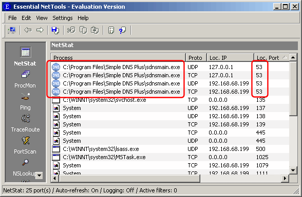

---
title: Error message "Could not start DNS service on <ip-address> port 53 UDP. Port is used by another application" or "Could not start DNS service (Error 10048)"
category: 14
frontpage: false
comments: true
refs: 46
created-utc: 2019-01-01
modified-utc: 2019-01-01
---

This error message means that some other software on your computer is using the DNS port (53). 

If you are running Simple DNS Plus on Windows 98se/2000 or later, it could be that you are using "Internet Connection Sharing", which "maps" DNS requests and uses the same port (53) as DNS servers. 
See <a href="/kb/132/using-simple-dns-plus-with-internet-connection-sharing-ics">How do I use Simple DNS Plus with Internet Connection Sharing?</a> 
 
Proxy servers often include a DNS proxy/mapping function which can cause this. 
See <a href="/kb/56/how-do-i-use-simple-dns-plus-with-a-proxy-server">How do I use Simple DNS Plus with a proxy server?</a>

Other software like network monitors could also by occupying port 53.

To find out what software is using the DNS port:

<strong>
Windows XP (SP2) / Server 2003 (SP1) and later Windows versions
</strong>

At a command prompt, type "NETSTAT -nabp UDP" to also see which application is using each UDP port. 

<strong>
Windows NT4 / 2000
</strong>

You can use "Essential NetTools" to find out which programs are using which ports. 
You can download an evaluation version of this program from <a href="http://www.tamos.com/" target="_blank">www.tamos.com</a>.

From the "Settings" menu, select "Options...". 
Under Tools/NetStat, check "Show full process path", and UN-check "Convert ports to service names", and click the "OK" button:

 

Back in the main window, locate programs using port 53:

 

The above sample shows Simple DNS Plus using these ports - you should see some other program.
