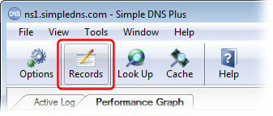
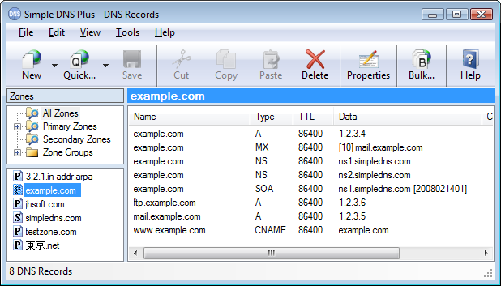

# Basic DNS Server Configuration Example

From the main screen of Simple DNS Plus, click the "Records" button on the tool bar:

This opens the "DNS Records" dialog - from here click the "Quick..." button on the tool bar:

Now enter your domain name, and the IP addresses of any servers you will be using. These are all optional, and can be added later if needed. If two or more of these servers are running on the same computer, you just enter the same IP address. Click "OK" to continue.

Now all the basic DNS records have been created.  
You can add more records using the "New" button, or edit the records' properties simply by double clicking on each record. 

When you close the DNS Records window, the DNS server is configured and ready to serve its first visitor.

