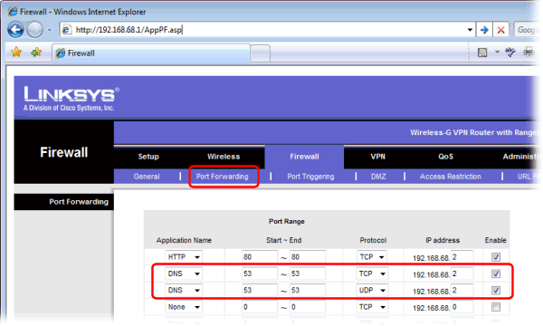

---
title: How do I use Simple DNS Plus with my Cable/DSL Router (NAT Router)?
category: 6
frontpage: false
comments: true
created-utc: 2019-01-01
modified-utc: 2019-01-01
---

Computers and devices behind a NAT router all have private IP addresses (typically 192.168.x.x), which are translated into a shared public&nbsp;IP addresses by the router.

To run a server behind the router, incoming TCP/IP traffic must be "mapped" to the server on a private IP address based on port numbers. 
NAT routers typically have a web interface with a section where you can configure "port mappings", "port forwarding", or something&nbsp;similar.

Simple DNS Plus (and other DNS servers) use port number 53 UDP and TCP.

So you need to map for incoming traffic to port 53&nbsp;to be forwarded to the local IP address of the computer running Simple DNS Plus. 
With some routers you&nbsp;must create two separate mappings - one for each protocol "UDP" and "TCP". 
Other&nbsp;routers&nbsp;allow you to do this with a single port&nbsp;mapping for "BOTH".

This&nbsp;sample screen shot is from a Linksys router:

		 

NOTE: If you are running servers (any type) behind a NAT router, the DNS records for these servers must point to the public Internet IP address - not the private server IP address (192.168.x.x).
