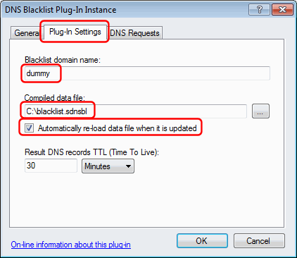
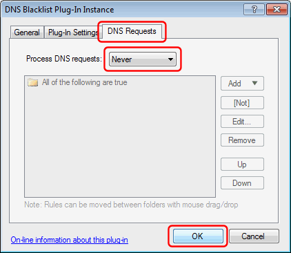
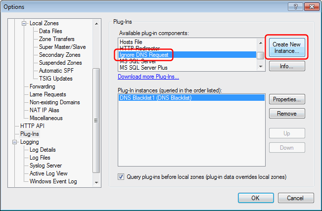
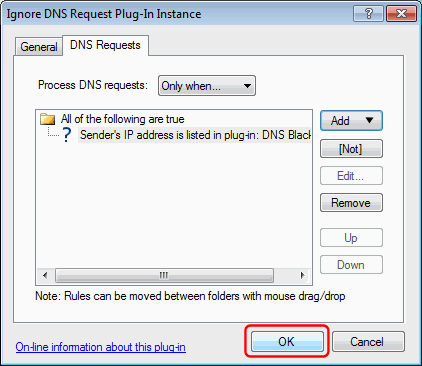

# Blocking DNS requests from IP addresses in blacklist

This is an example of how you might combine the functionality of two different plug-ins to achieve something else.  

Using the [DNS Blacklist plug-in](https://simpledns.plus/plugin-blacklist) and the [Ignore DNS Request plug-in](https://simpledns.plus/plugin-ignorereq) it is possible to block (ignore) DNS requests originating from IP addresses listed in a DNSBL/RBL style blacklist (can be as simple as a plain text list of IP addresses separated by line feeds).  

Note that Simple DNS Plus has a built-in feature to ignore DNS requests from specified IP addresses - see main windows / Tool menu / IP Address Blocking.  
You can also use the Ignore DNS Request plug-in by itself - specifying the IP addresses in the DNS Requests tab.  
However, the following may be easier to use and/or more efficient if you have a really long list of IP addresses, or if you want to automate this in some way.  

First you need to create (or download) a list of IP addresses that you want to block, and then "compile" this into the format understood by the DNS Blacklist plug-in using the [DNS Blacklist Editor](https://simpledns.plus/dnsbl-editor) tool (can also be used from command line / batch scripts for automation).  

Next [download](https://simpledns.plus/plugins) the DNS Blacklist plug-in and unzip this to the plug-ins folder. The Ignore DNS request plug-in comes with Simple DNS Plus, so you don't need to prepare anything for this.  

Then, in the Simple DNS Plus Options dialog, Plug-Ins section, select the "DNS Blacklist" component and click the "Create New Instance..." button:  

  

In the Plug-In Instance dialog, select the "Plug-In Settings" tab, and enter something in the "Blacklist domain name" field (doesn't matter what), specify the location of the compiled blacklist file.  
Check "Automatically re-load data files when it is updated" if you want the file reloaded whenever you recompile it:  

  

In the "DNS Requests" tab, under "Process DNS requests" select "Never".  
This prevents this DNS Blacklist plug-in from processing any DNS requests directly.  
Click the "OK" button to save the plug-in configuration:  

  

Back in the Options dialog, select the "Ignore DNS Request" component and click the "Create New Instance..." button:  

  

In the Plug-In Instance dialog, select the "DNS Requests" tab, under "Process DNS requests" select "Only when...", click the "Add" button, then "Sender's IP address", then "is listed in plug-in", then "DNS Blacklist1":  

  

Click the "OK" button to save the plug-in configuration:  

  

Back in the Options dialog you should now have an instance of both the DNS Blacklist plug-in and the Ignore DNS Request plug-in listed.  
Click the "OK" button to save:  

  

Now all DNS requests originating from IP addresses in the blacklist will be ignored.  

Note: .NET developers may also consider [creating their own](/kb/31/developing-plug-ins-for-simple-dns-plus-v5-2-and-later) dedicated plug-in for ignoring/blocking requests according to their own custom rules using the "JHSoftware.SimpleDNS.Plugin.IIgnoreRequestPlugIn" interface.