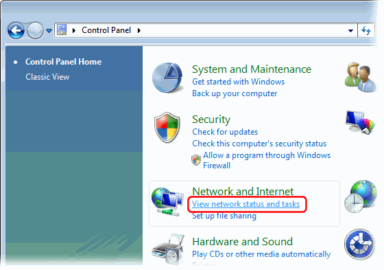
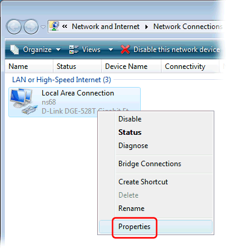
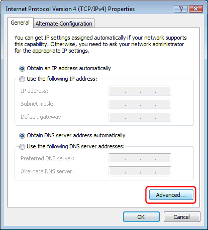
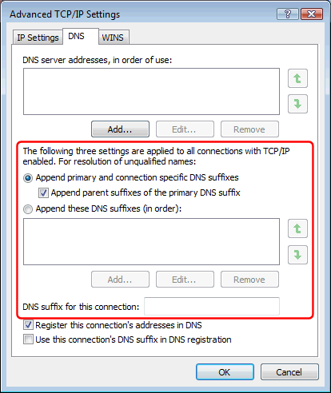

---
category: 11
frontpage: false
comments: true
refs: 75,142
created-utc: 2019-01-01
modified-utc: 2021-11-01
---
# How to configure DNS suffixes on Windows

"DNS suffixes" are used for resolving unqualified domain names (names with no dots).

In the Windows Control Panel, under "Network and Internet" click the "View network status and tasks" link:

Click the "Manage network connections" link:

Right-click a network connection and select "Properties" from the pop-up menu:

In the network connection Properties dialog select "Internet Protocol Version 4 (TCP/IPv4)" and click the "Properties" button:

In the "Internet Protocol Version 4 (TCP/IPv4) Properties" dialog click the "Advanced..." button:

In the "Advanced TCP/IP Settings" dialog select the "DNS" tab, and specify which DNS suffixes to use for resolving unqualified domain names:

If you choose the first (and default) option to append primary and connection specific DNS suffixes, then you will also need to configure the primary DNS suffix. See reference article below.

