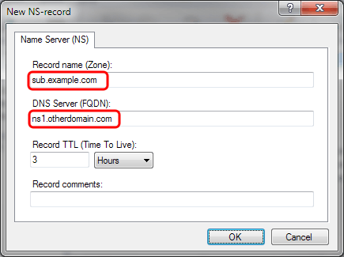
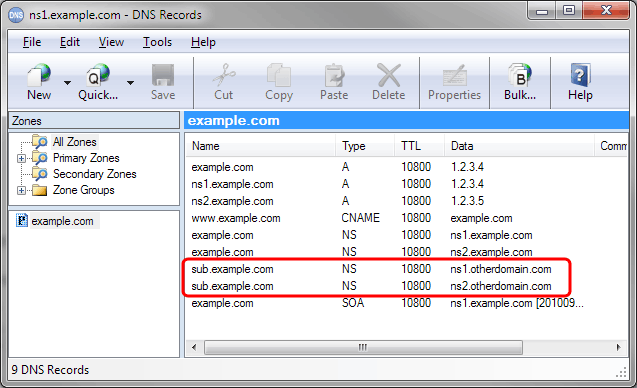
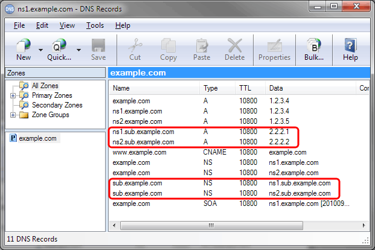

# How to delegate a sub-domain to other DNS servers

To do this, you need to add NS-records for the sub-domain name pointing to the host names of the DNS servers hosting the sub-domain - in the parent zone.

In the "DNS records" window right-click the parent zone in the left list and select "New NS-record":

  
In the "New NS-record" dialog, enter the sub-domain name and the host name of one of the DNS servers hosting the sub-domain:

Repeat the previous steps, so that you have an NS-record for each DNS server hosting the sub-domain:

Note that it is important that matching A-records exist for DNS server host names listed in these NS-records.  
For the example above, A-records must exist for "ns1.otherdomain.com" and "ns2.otherdomain.com" - in the "otherdomain.com" zone on whatever DNS server is hosting "otherdomain.com".

If the DNS server host names are themselves sub-names of the domain name being delegated, it is necessary to include a copy of these A-records in the parent zone. These are called "glue records".  
Otherwise other DNS servers will have no way to find the sub-domain's DNS servers, and therefore no way to resolve records in the sub-domain.  
In the screen shot below, the highlighted A-records are such "glue records":

