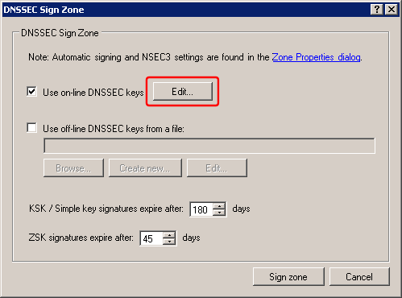
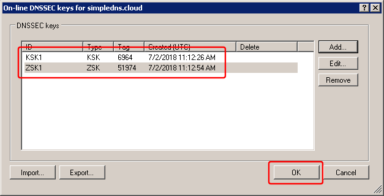
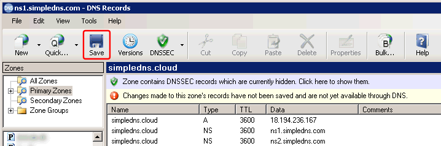
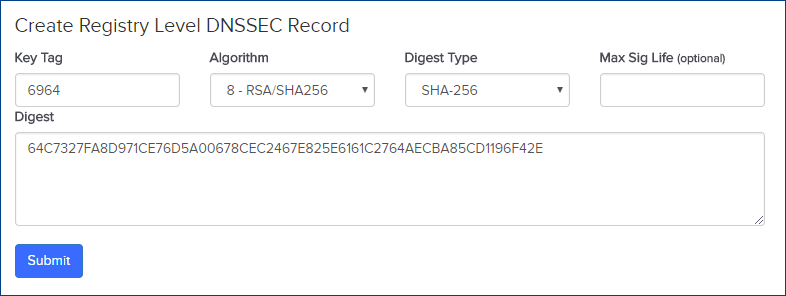
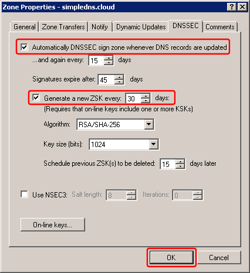

---
category: 2
frontpage: false
comments: true
created-utc: 2019-01-01
modified-utc: 2019-01-01
---
# How to DNSSEC sign a zone with Simple DNS Plus

To sign a zone, in the DNS Records window, select the zone to be signed, open the DNSSEC drop-down menu on the toolbar, and select "Sign...":

In the "DNSSEC Sign Zone" dialog, click the "Edit..." button next to "Use on-line DNSSEC keys":

In the "On-line DNSSEC keys" dialog, click the "Add..." button:

First create a key of the "KSK" type. We recommend using the RSA/SHA-256 algorithm and a 2048 bit key size:

And then a key of the "ZSK" type. We recommend using the RSA/SHA-256 algorithm and a 1024 bit key size:

You should now have one KSK and one ZSK. Click the OK button in the "On-line DNSSEC keys" dialog:

Back in the "DNSSEC Sign Zone" dialog, click the "Sign zone" button:

Back in the DNS Records window, click the "Save" button:

The zone is now signed. 

Next, we need to generate a DS-record and have this included in the parent zone.

In the DNS Records window, open the "DNSSEC" button drop-down menu and select "Generate DS-records...":

This opens the "DNSSEC DS-records" dialog:

Now we need to copy this record to the parent zone. The way this is done varies for each domain name registrar.

As an example, with "name.com" (a domain name registrar), you log into your account, select "My domains", click the "Quick Links" drop-down next to the domain name, and select "Edit nameservers". On the "Edit Nameservers" page, there is a link to "DNSSEC Management page". And here there is a form to enter the DS-record data.

Copy the data from the "DNSSEC DS-records" dialog above to the registrars form and submit this:

At this point you may want to test the DNSSEC setup using one of the available on-line tools. For example <http://dnsviz.net>

Finally we can configured the zone to be automatically re-signed whenever we update its records.

In the DNS Records window, open the "DNSSEC" button drop-down menu and select "Settings...":

This opens the Zone Properties dialog on the DNSSEC tab.

Check "Automatically DNSSEC sign zone..." and "Generate a new ZSK every..." to have this automated as much as possible:

Note that you should "rollover" the KSK every 1-2 years. Read more about this at <https://simpledns.plus/help/definition-dnssec>