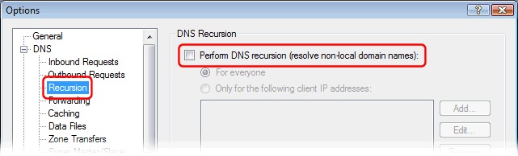
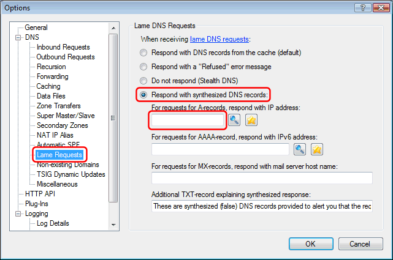

# How to make Simple DNS Plus respond with the same IP address for any domain name

In the main Window of Simple DNS Plus, click the "Options" button:

In the Options dialog, select the "Recursion" section, and UN-check "Perform DNS recursion" (*):

Select the "Lame Requests" section, and check "Respond with synthesized DNS records", and enter the IP address you want it to return in the "For requests for A-records..." field:

If you want to also return the same e-mail server for any domain name, also fill out the "For requests for MX-record..." field with the host name of the e-mail server (like "mail.example.com").

NOTE: You can still setup records for specific domain names in the DNS Records window etc. which will always override above setting - for example if you want to exclude certain domain names.

NOTE: If you want to exclude some clients (like your own local IP addresses) from getting this same data for all domain names, you can use the "Only for the following client IP addresses" option in the Recursion section to specify exceptions.

