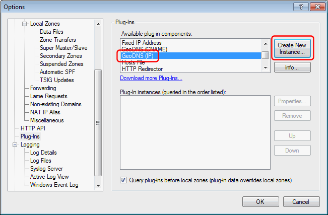
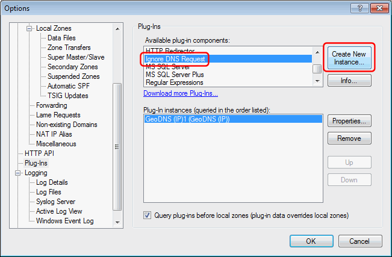
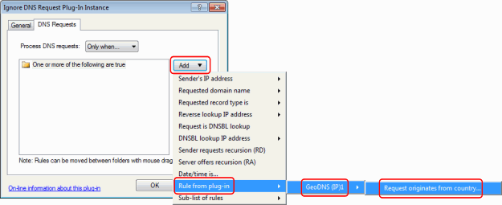
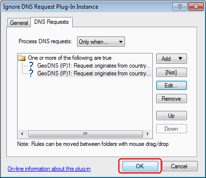
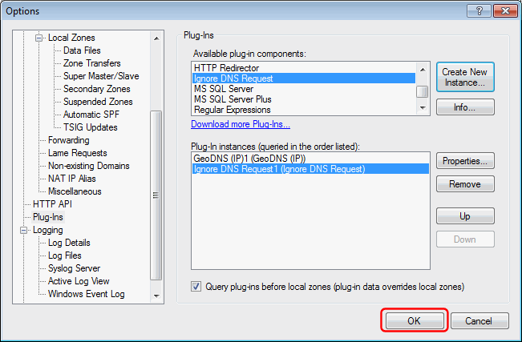

---
category: 8
frontpage: false
comments: true
created-utc: 2019-01-01
modified-utc: 2019-01-01
---
# Blocking DNS requests from specific countries

This is an example of how you might combine the functionality of two different plug-ins to achieve something else.

Using the [GeoDNS plug-in](https://simpledns.plus/plugin-geodns) and the [Ignore DNS request plug-in](https://simpledns.plus/plugin-ignorereq) it is possible to block (ignore) DNS requests from specified countries.

First download the GeoDNS plug-in and unzip this to the plug-ins folder, and download and unzip the ip-to-country database file (see [this article](https://simpledns.plus/plugin-geodns)).  
The Ignore DNS request plug-in comes with Simple DNS Plus, so you don't need to prepare anything for this.

Then, in the Simple DNS Plus Options dialog, Plug-Ins section, select the "GeoDNS (IP)" component and click the "Create New Instance..." button:

In the Plug-In Instance dialog, select the "Plug-In Settings" tab, and something in the "Host name" field (doesn't matter what), specify the location of the un-zipped IP-to-country data file, and enter some IP address in the "Default server IP address" field (doesn't matter what):

In the "DNS Requests" tab, under "Process DNS requests" select "Never".  
This prevents this GeoDNS plug-in from processing any DNS requests directly.  
Click the "OK" button to save the plug-in configuration:

Back in the Options dialog, select the "Ignore DNS Request" component and click the "Create New Instance..." button:

In the Plug-In Instance dialog, select the "DNS Requests" tab, under "Process DNS requests" select "Only when...", select the first/only entry in the list, click the "Edit..." button, select "One or more of the following are true" and click the "OK" button:

Click the "Add" button, then "Rule from plug-in", then "GeoDNS (IP)1", then "Request originates from country...":

Enter the 2 letter ISO code for the country that you wish to block requests from (for example "NL" for the Netherlands):

Add another entry for each country that you wish to block the same way.  
When done, click the "OK" button to save the plug-in configuration:

Back in the Options dialog you should now have an instance of both the GeoDNS (IP) plug-in and the Ignore DNS Request plug-in listed.  
Click the "OK" button to save:

Now all DNS requests originating from the specified countries will be ignored.  
