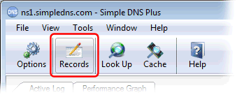

---
category: 11
frontpage: false
comments: true
created-utc: 2019-01-01
modified-utc: 2019-01-01
---
# How to publish GPS coordinates for your domain name

You can specify GPS coordinates (latitude / longitude) for your domain name using a DNS LOC-record ([RFC1876](http://www.rfc-editor.org/rfc/rfc1876.txt)).

First use a GPS receiver to figure out your coordinates.

To add a LOC-record in Simple DNS Plus, in the main window click the "Records" button:

Then right-click on the zone name in the left list, and from the popup menu select "Other new record" and then "LOC-record":

Enter your coordinates. For most purposes you can just enter Latitude and Longitude and leave the other fields at their default values:

