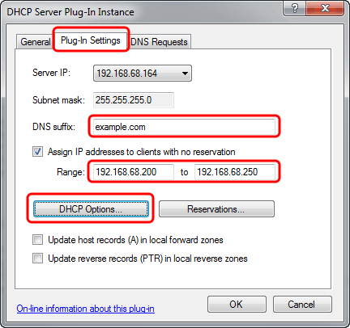
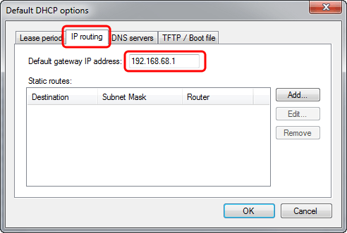
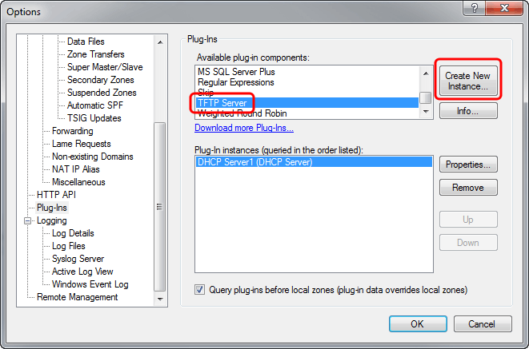
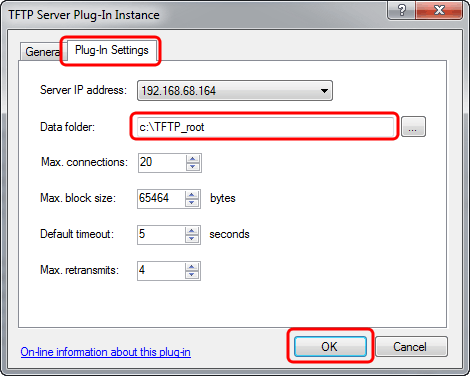
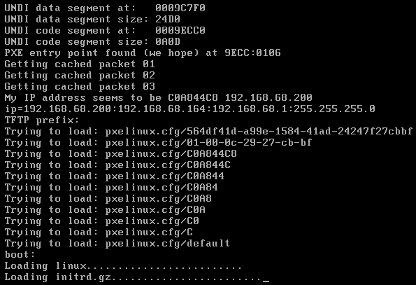

---
category: 8
frontpage: false
comments: true
created-utc: 2019-01-01
modified-utc: 2019-01-01
---
# How to serve a network based Debian Linux installation with Simple DNS Plus

This articles describes how to install Debian Linux over the network (no CDs, floppy-disks, USB keys, etc.) using the [DHCP Server](https://simpledns.plus/plugin-dhcp) and [TFTP Server](https://simpledns.plus/plugin-tftp) plug-ins in Simple DNS Plus (running on a Windows computer).

This Debian Linux installation is just an example to demonstrate the DHCP/TFTP plug-in combination.  
Similar procedures can be used to network install or boot other operating systems, or provision IP phones and other devices.

You will need two computers (real or virtual) - one running Windows and Simple DNS Plus, and another empty computer (to install Debian Linux on) with a BIOS and network card that support PXE booting (most computers/network cards manufatured since ~2000 support this). Make sure PXE / network booting is enabled in BIOS.

First, make sure that you have the lastest version of Simple DNS Plus installed ([download](https://simpledns.plus/download)), as well as the lastest release of the [DHCP Server](https://simpledns.plus/plugin-dhcp) and [TFTP Server](https://simpledns.plus/plugin-tftp) plug-ins.

Next, prepare the TFTP folder structure:  
1) Create a directory on the Simple DNS Plus computer to be the TFTP root - for example C:\TFTP_Root.  
2) Download the 3 files [pxelinux.0](http://http.us.debian.org/debian/dists/lenny/main/installer-i386/current/images/netboot/debian-installer/i386/pxelinux.0), [initrd.gz](http://http.us.debian.org/debian/dists/lenny/main/installer-i386/current/images/netboot/debian-installer/i386/initrd.gz) and [linux](http://http.us.debian.org/debian/dists/lenny/main/installer-i386/current/images/netboot/debian-installer/i386/linux) (right-click / Save target as...) to the TFTP root. Make sure the file "linux" has no file extension (Windows might add ".txt")  
3) Under the TFTP root, create a new folder "pxelinux.cfg".  
4) Download the file [default](https://simpledns.plus/kb1304-default.ashx) to the "pxelinux.cfg" folder.

The next step will be to configure the DHCP server and TFTP server plug-ins in Simple DNS Plus.  
From the main Window click the "Options" button, then select "Plug-ins" in the left list, under "Available plug-in components" select "DHCP Server", and click the "Create New Instance..." button:

In the "DHCP Server Plug-In Instance" dialog, select the "Plug-In Settings" tab, fill in the "DNS Suffix" and IP address range, and click the "DHCP Options..." button:

In the "Default DHCP options" dialog, select the "IP routing" tab, and enter the IP address of your Internet router:

Selec the "TFTP / Boot file" tab, in the "TFTP server IP address" field enter the IP address of the computer running Simple DNS Plus, and in the "Boot file name" field enter "pxelinux.0", click the "OK" button in this and the previous dialog:

Back in the Options dialog, under "Available plug-in components" select "TFTP Server" and click the "Create New Instance" button:

In the "TFTP Server Plug-In Instance" dialog, select the "Plug-In Settings" tab, in the "Data folder" field enter the path to the TFTP root folder created earlier, and click the "OK" button in this and all the previous dialogs.

Now turn on the second computer and you should see Simple DNS Plus assigning it an IP address (via DHCP) and then TFTP file transfer requests in the Simple DNS Plus log:

On the second computer you should see a matching boot sequence:

Shortly after, the Debian Linux installation prompts should appear, and it will automatically download remaining files from the Internet:  
  
