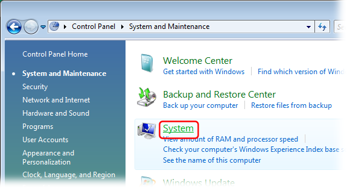
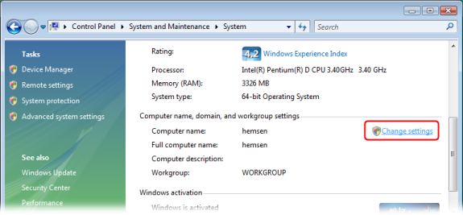
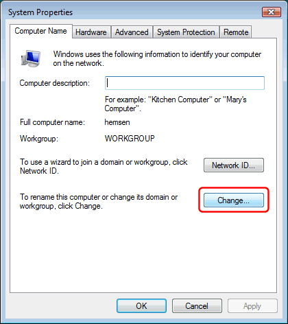

---
title: How to set the primary DNS suffix on Windows Vista/2008
category: 11
frontpage: false
comments: true
refs: 63,142
created-utc: 2019-01-01
modified-utc: 2019-01-01
---

The Windows "Primary DNS suffix" is by default used for resolving unqualified domain names (names with no dots).

In the Windows Control Panel, click the "System and Maintenance" link:

Click the "System" link:

 

Scoll down to the "Computer name, domain, and workgroup settings" section, and click the "Change settings" link:

In the "System Properties" dialog in the "Computer Name" tab, click the "Change..." button:

In the "Computer Name/Domain Changes" dialog, click the "More..." button:

Enter the Primary DNS suffix:

