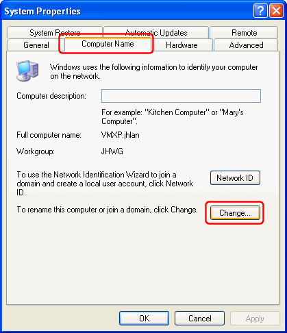

---
category: 11
frontpage: false
comments: true
refs: 60,142
created-utc: 2019-01-01
modified-utc: 2019-01-01
---
# How to set the primary DNS suffix on Windows XP/2003

The Windows "Primary DNS suffix" is by default used for resolving unqualified domain names (names with no dots).

In the Windows Control Panel, double-click the "System" icon:

In the "System Properties" dialog, select the "Computer Name" tab and click the "Change..." button:

In the "Computer Name Changes" dialog, click the "More..." button:

Enter the primary DNS suffix:

